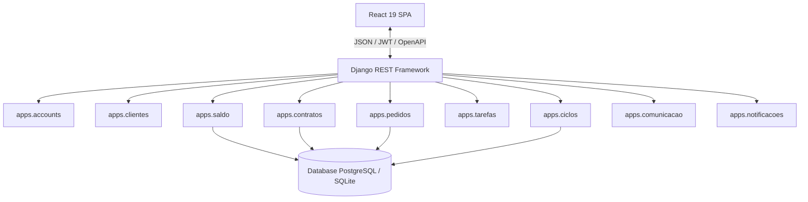
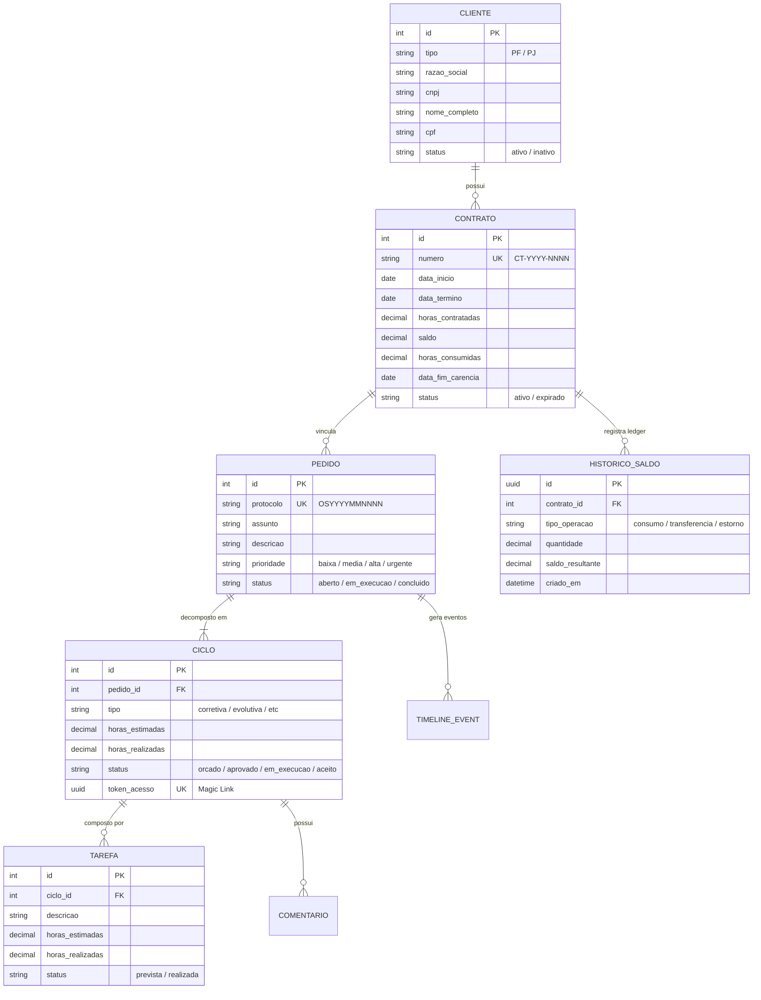
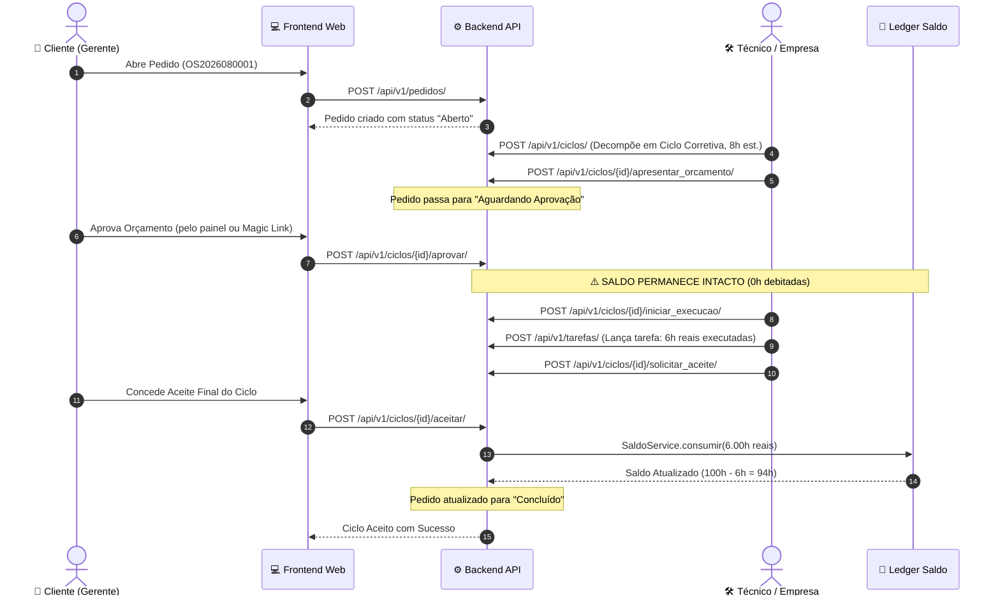

# 🏛️ Documento de Arquitetura do SHM 2.3 (Main Release 2.3 — Feature Clientes)

## 1. Visão Geral e Princípios Arquiteturais

O SHM 2.3 foi concebido seguindo os princípios de **Clean Architecture**, **Domain-Driven Design (DDD)** modular no Django e uma separação estrita entre o cliente Frontend (SPA) e a API Backend RESTful.

---

## 2. Modelagem de Dados & ERD

---

## 3. Diagrama de Sequência: Ciclo de Atendimento & Débito no Aceite

---

## 4. Segurança & Controle de Acesso (RBAC)

O SHM 2.0 implementa 4 níveis de perfis de acesso:
1. **`EMPRESA_ADMIN`**: Acesso irrestrito a todos os clientes, gestão financeira de contratos, reabastecimentos, transferências e configuração de equipe.
2. **`EMPRESA_TECNICO`**: Acesso à fila operacional, triagem de pedidos, emissão de orçamentos e apontamento de tarefas.
3. **`CLIENTE_GERENTE`**: Tomador do contrato. Possui permissão para autorizar orçamentos, aprovar/recusar aceites finais e visualizar extratos financeiros.
4. **`CLIENTE_ANALISTA`**: Usuário operacional do cliente. Pode abrir pedidos de suporte e interagir nos comentários dos ciclos.