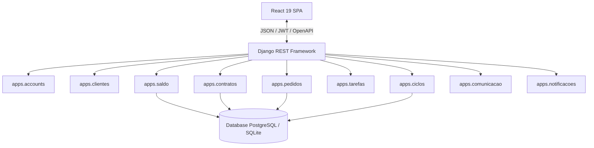
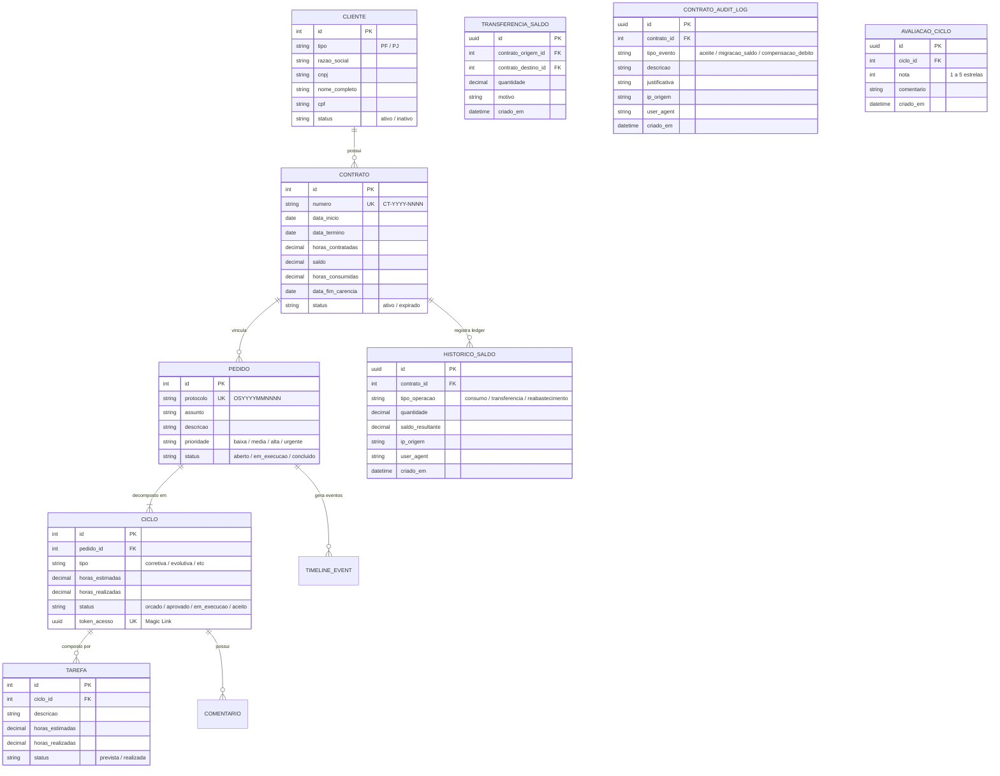
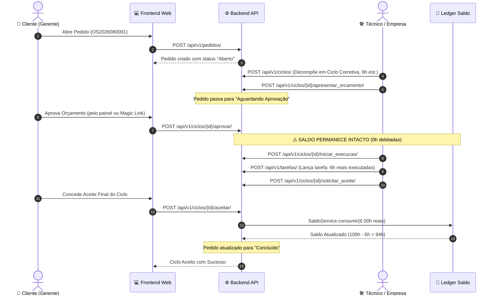

# 🏛️ Documento de Arquitetura do SHM 2.5 (Main Release 2.5 — Governança Forense & SDD)

## 1. Visão Geral e Princípios Arquiteturais

O SHM 2.5 foi concebido seguindo os princípios de **Clean Architecture**, **Domain-Driven Design (DDD)** modular no Django e uma separação estrita entre o cliente Frontend (SPA) e a API Backend RESTful.

---

## 2. Modelagem de Dados & ERD

---

## 3. Diagrama de Sequência: Ciclo de Atendimento & Débito no Aceite

---

## 4. Segurança & Controle de Acesso (RBAC)

O SHM 2.5 implementa 4 níveis de perfis de acesso:
1. **`EMPRESA_ADMIN`**: Acesso irrestrito a todos os clientes, gestão financeira de contratos, reabastecimentos, transferências e configuração de equipe.
2. **`EMPRESA_TECNICO`**: Acesso à fila operacional, triagem de pedidos, emissão de orçamentos e apontamento de tarefas.
3. **`CLIENTE_GERENTE`**: Tomador do contrato. Possui permissão para autorizar orçamentos, aprovar/recusar aceites finais e visualizar extratos financeiros.
4. **`CLIENTE_ANALISTA`**: Usuário operacional do cliente. Pode abrir pedidos de suporte e interagir nos comentários dos ciclos.

---

## 5. Racional da Stack Tecnológica & Decisões Arquiteturais (ADR Synthesis)

Alinhado ao [**Manifesto de Engenharia SHM**](Manifesto/manifesto.md) e ao guia **SWEBOK**, cada elemento da stack foi selecionado para atuar como **fronteira de contenção (Agent Harness)**:

1. **Django 5.2 + DRF vs. Microframeworks**:
   - *Decisão*: Optou-se pelo Django devido à solidez do seu ORM transacional (`@transaction.atomic`), motor de migrações determinísticas e autenticação RBAC nativa.
   - *Ganho de Engenharia*: Impede que agentes de IA reinventem regras contábeis, garantindo consistência ACID no livro-razão `HistoricoSaldo`.
2. **React 19 + TypeScript 5.7 vs. JavaScript Puro**:
   - *Decisão*: Tipagem estrita ponta a ponta com interfaces compartilhadas.
   - *Ganho de Engenharia*: O compilador TypeScript atua como portão imediato de verificação pré-runtime, eliminando quebras de contrato de API.
3. **Reversa (SDD) & Impeccable (Craft UI/UX)**:
   - *Decisão*: Especificações vivas em `_reversa_sdd/` e heurísticas rigorosas de interface.
   - *Ganho de Engenharia*: Elimina o *Vibe Coding* e o débito técnico estético (*AI slop*), mantendo a evolução linear e previsível.
4. **Ferramental Dev Próprio (`tools/`)**:
   - *Decisão*: Servidor SMTP local (`dev_mail_server.py`) e orquestrador CLI (`dev.ps1`).
   - *Ganho de Engenharia*: Ambiente de testes 100% autossuficiente e offline, com custo zero de infraestrutura e privacidade total de dados em desenvolvimento.