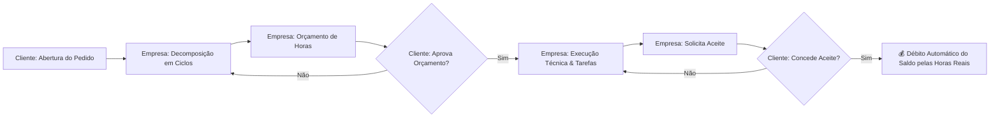

<div align="center">

# ⏱️ SHM — Support Hours Manager 2.5

**Main Release 2.5 — Gestão Inteligente de Saldo, Compensação de Débitos, Conciliação no Extrato Oficial, Auditoria Forense Dupla & Framework Reversa**

[](https://www.djangoproject.com/)
[](https://react.dev/)
[](https://www.typescriptlang.org/)
[](https://vitejs.dev/)
[](https://tailwindcss.com/)
[](http://localhost:8000/api/docs/)
[](https://docs.pytest.org/)
[](https://github.com/sandeco)

[Visão Geral](#-visão-geral) • [Novidades v2.5](#-principais-recursos-da-versão-25) • [Regras de Negócio](#-regras-de-ouro-do-domínio) • [Arquitetura](#-arquitetura-do-sistema) • [Créditos Reversa & Prof. Sandeco](#-mentoria-engenharia-reversa--créditos-acadêmicos) • [Como Executar](#-como-executar) • [Documentação](#-documentação-detalhada)

---

</div>

## 📌 Visão Geral

O **SHM (Support Hours Manager)** é uma solução de alta integridade desenhada para resolver os gargalos de transparência, conciliação e atrito na gestão de contratos de suporte e consultoria técnica de TI.

Diferente de sistemas convencionais de chamados que misturam horas orçadas com horas faturadas, o **SHM 2.5** opera com **Decomposição Atômica em Ciclos**, **Livro-Razão Forense (Ledger Imutável)**, **Assistente Inteligente de Migração de Saldo & Compensação de Débitos**, e aprovação sem atrito via **Magic Links** e auditoria contratual periciável.



---

## 🌟 Principais Recursos da Versão 2.5

1. **⚡ Assistente Inteligente de Aproveitamento & Resgate de Saldo**:
   - Sugestão automática ao cadastrar um novo contrato para aproveitar saldo positivo remanescente de contratos concluídos/encerrados do mesmo cliente.
   - Assistente manual de migração (`MigracaoSaldoModal`) acessível diretamente pelo Extrato Oficial.

2. **⚖️ Compensação & Quitação de Saldo Devedor com Trava de Teto**:
   - Encontro de contas na abertura do novo contrato para liquidar débitos técnicos de contratos anteriores.
   - Trava de teto que impede o abatimento de valor superior à dívida real ou superior à franquia contratada.

3. **🛡️ Operação 100% Atômica no Backend (`@transaction.atomic`)**:
   - Cadastro de contrato, resgate de saldo positivo e abatimento para quitação de débito ocorrem em um único bloco atômico no banco de dados.

4. **📊 Conciliação Visual no Extrato Oficial**:
   - Cards minimalistas e régua matemática dedicada **∑ Demonstrativo de Conciliação de Horas** com pills ilustrados:
     `[ 🏢 Franquia Base ]` `[ ⚡ +Resgate ]` `[ ⚖️ -Compensação ]` `[ ⏱️ -Consumo ]` `=` `[ ✓ Saldo Atual ]`.

5. **🔍 Trilha de Auditoria Forense Dupla & Livro-Razão (Ledger)**:
   - Registro simultâneo e imutável em `HistoricoSaldo` (Ledger) e `ContratoAuditLog` em ambos os contratos envolvidos (origem e destino / novo e devedor), capturando IP, User-Agent, carimbo temporal, justificativa e autor.
   - Cálculo e validação criptográfica de integridade de documentos anexos via **SHA-256**.

6. **🔔 Governança de Notificações In-App & E-mails Transacionais**:
   - Alertas instantâneos no sininho do app (`Notification`) e templates HTML responsivos para avisos de aproveitamento, compensação e magic link de aceite.

---

## 💎 Regras de Ouro do Domínio

1. **Hierarquia Estrutural**:
   - **Cliente (PF/PJ)** $\rightarrow$ Possui 1 ou mais **Contratos**.
   - **Contrato (`CT-YYYY-NNNN`)** $\rightarrow$ Controla franquia contratada, vigência, carência de 30 dias pós-expiração e saldo.
   - **Pedido de Suporte (`OSYYYYMMNNNN`)** $\rightarrow$ Demanda ampla aberta pelo cliente.
   - **Ciclos de Atendimento** $\rightarrow$ Recortes atômicos classificados em:
     - `Corretiva`, `Evolutiva`, `Preventiva`, `Análise`, `Consultoria`, `Treinamento`.
   - **Tarefas** $\rightarrow$ Apontamentos de horas executadas pelo técnico dentro do ciclo.

2. **Débito de Saldo Exclusivamente no Aceite**:
   - A aprovação do orçamento **não consome saldo** do contrato (evita travar horas em demandas que sofram alterações de escopo).
   - O débito ocorre **apenas no Aceite Formal do Ciclo** pelo cliente, debitando o total de **horas reais realizadas** (`horas_realizadas`).
   - Trava de tolerância de 30% com fluxo de aprovação de exceção para horas excedentes.

3. **Ledger Imutável de Auditoria (`HistoricoSaldo`)**:
   - Toda movimentação de saldo (Consumo, Transferência entre contratos do mesmo cliente, Reabastecimento, Estorno) gera um registro imutável com carimbo temporal e autor responsável.

4. **Magic Links Públicos (Zero Atrito)**:
   - Links com token UUID único são disparados para tomadores/diretores aprovarem orçamentos e assinarem aceites em 1 clique direto pelo smartphone ou navegador, sem necessidade de autenticação prévia.

---

## 🎓 Mentoria, Engenharia Reversa & Créditos Acadêmicos

<div align="center">

### 🧠 Desenvolvido sob a Mentoria do Prof. Sandeco Macedo & Framework Reversa

</div>

Este projeto foi reestruturado, documentado e especificado utilizando o **Framework Reversa**, uma metodologia e ecossistema de engenharia reversa de software orientado a **Agentes Autônomos de IA** e **Spec-Driven Development (SDD)**, idealizado e mantido pelo **Prof. Sandeco Macedo**.

### 👨‍🏫 Sobre o Prof. Sandeco Macedo
- **Pesquisador & Docente:** Professor e pesquisador no **Instituto Federal de Goiás (IFG)** e na **Universidade Federal de Goiás (UFG)**.
- **Embaixador Campus Party Brasil:** Liderança comunitária e referência nacional na disseminação de Inteligência Artificial, Ciência de Dados e Deep Learning.
- **Autor & Escritor:** Autor de mais de 10 livros consagrados sobre Inteligência Artificial, Agentes Inteligentes, Retrieval-Augmented Generation (RAG), Visão Computacional e Engenharia de Prompts.
- **Criador do Framework Reversa:** Pioneiro no desenvolvimento de arquiteturas multi-agentes para resgate, arqueologia de código e modernização de sistemas legados para a era dos LLMs.

### 🏛️ O Papel do Framework Reversa no SHM 2.5
O **Reversa** operou neste repositório por meio de uma equipe especializada de agentes inteligentes:
- 🕵️ **Scout & Arqueólogo:** Mapeamento estrutural, extração da topologia e reconstrução da cronologia e contratos de negócio.
- 📐 **Arquiteto (SDD):** Formulação das especificações executáveis em `_reversa_sdd/`, C4 Models, dicionário de dados e ADRs (Architectural Decision Records).
- 🚀 **Forward Engineer:** Implementação atômica e evolução guiada por especificações das features de tolerância de ciclos, migração de saldo e governança forense.
- 📊 **Docs Engine:** Renderização e catalogação da base de conhecimento técnico do projeto.

> *"O conhecimento técnico de um sistema não pode ficar aprisionado no código: ele deve ser compreendido, formalizado em contratos vivos e executável por agentes."* — **Prof. Sandeco Macedo**

---

## 🏛️ Arquitetura do Sistema

```
projeto-SHM/
├── _reversa_sdd/             # Especificações SDD (Spec-Driven Development) do Reversa
│   ├── adrs/                 # Architectural Decision Records (ADR 001 a 007)
│   ├── addenda/              # Adendos de convergência das features evolutivas
│   └── ...                   # C4 Models, contratos e dicionários de dados
│
├── backend/                  # Django 5 REST Framework
│   ├── apps/
│   │   ├── accounts/         # Usuários customizados e RBAC (Empresa vs Cliente)
│   │   ├── clientes/         # Cadastro PF/PJ com validação de CPF/CNPJ
│   │   ├── contratos/        # Gestão contratual, upload com SHA-256 e extratos
│   │   ├── pedidos/          # Protocolos OS, agrupador de chamados
│   │   ├── ciclos/           # Workflow de ciclos, estados e Magic Links
│   │   ├── tarefas/          # Apontamento técnico de esforço e horas reais
│   │   ├── saldo/            # Ledger imutável, transferências e compensação de débitos
│   │   ├── comunicacao/      # Thread de comentários e conversão em tarefas
│   │   ├── notificacoes/     # Notificações in-app e eventos de timeline
│   │   └── core/             # Middlewares, permissions e comando seed_demo_data
│   ├── config/               # Settings, JWT, URLs e OpenAPI Swagger
│   └── tests/                # Suíte de 73 testes unitários e de integração
│
├── frontend/                 # React 19 + TypeScript + Vite + Tailwind CSS
│   └── src/
│       ├── api/              # Cliente Axios com interceptors JWT e auto-refresh
│       ├── components/
│       │   ├── layout/       # Header, Sidebar de Contratos, AppLayout
│       │   ├── kanban/       # Kanban Board responsivo de 6 colunas
│       │   ├── contratos/    # Modais de Novo Contrato, Migração de Saldo, Documentos
│       │   └── ciclos/       # Carrossel navegável de ciclos e comentários
│       ├── contexts/         # AuthContext com controle de permissões
│       ├── pages/            # Extrato Oficial (com conciliação ∑), Login, Dashboards
│       └── types/            # Tipos e interfaces estritas TypeScript
│
└── docs/                     # Documentação de API, Workflow e Arquitetura
```

---

## 🚀 Como Executar

### 1. Pré-requisitos
- **Python 3.11+**
- **Node.js 20+** ou **Bun 1.2+**
- **Git**

### 2. Backend (API REST)
```bash
# 1. Crie e ative o ambiente virtual
uv venv .venv
# No Windows PowerShell:
.\.venv\Scripts\activate

# 2. Instale as dependências
uv pip install -r backend/requirements.txt --python .venv\Scripts\python.exe

# 3. Execute as migrações do banco de dados
.\.venv\Scripts\python.exe backend/manage.py migrate

# 4. Popule com dados de demonstração (inclui contratos com saldo remanescente e devedor)
.\.venv\Scripts\python.exe backend/manage.py seed_demo_data

# 5. Inicie o servidor Django
.\.venv\Scripts\python.exe backend/manage.py runserver 8000
```
- 📖 **Swagger OpenAPI UI**: [http://localhost:8000/api/docs/](http://localhost:8000/api/docs/)
- ⚙️ **Painel Administrativo Django**: [http://localhost:8000/admin/](http://localhost:8000/admin/)

---

### 3. Frontend (Web App)
```bash
# 1. Acesse a pasta do frontend
cd frontend

# 2. Instale as dependências
npm install   # ou bun install

# 3. Inicie o servidor de desenvolvimento
npm run dev   # ou bun run dev
```
- 🌐 **Aplicação Web**: [http://localhost:5173](http://localhost:5173)

---

## 🔑 Credenciais de Demonstração

| Perfil | Usuário | Senha | Papel no Sistema |
| :--- | :--- | :--- | :--- |
| **Cliente Gerente** | `gerente.acme` | `cliente123` | Tomador da Acme Corp. Aprova orçamentos e concede aceites finais. |
| **Cliente Analista** | `analista.acme` | `cliente123` | Usuário solicitante da Acme Corp. Abre pedidos e acompanha kanban. |
| **Empresa Admin** | `admin` | `admin123` | Administrador prestador. Gestão geral de contratos, saldos e clientes. |
| **Empresa Técnico** | `tecnico` | `tecnico123` | Operador técnico. Triagem, estimativa de ciclos e apontamento de tarefas. |

---

## 🧪 Testes Automatizados

### Backend (Pytest — 73 Testes)
```bash
uv run --with-requirements backend/requirements.txt pytest
```

### Frontend (Build & Type-Check)
```bash
cd frontend && npm run build
```

---

## 📚 Documentação Detalhada

- 🏛️ [Arquitetura & Modelagem de Dados](ARCHITECTURE.md)
- 📐 [Especificações SDD do Reversa](_reversa_sdd/architecture.md)
- 📜 [Decisões Arquiteturais (ADRs)](_reversa_sdd/adrs/)
- 🔌 [Referência Completa da API REST](docs/API.md)
- 🔄 [Guia do Workflow e Ciclos de Atendimento](docs/WORKFLOW.md)
- 🤝 [Guia de Contribuição](CONTRIBUTING.md)

---

## 📄 Licença

Este projeto é desenvolvido sob a licença MIT. Consulte o arquivo `LICENSE` para mais detalhes.
