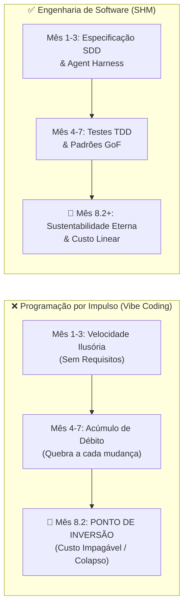
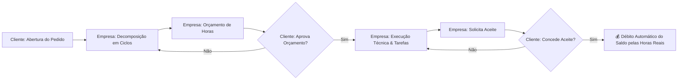

<div align="center">

# ⏱️ SHM — Support Hours Manager 2.5

**Engenharia de Software de Alta Integridade para Gestão de Contratos, Horas Técnicas, Ciclos de Atendimento e Governança Forense**

[](Manifesto/manifesto.md)
[](https://physia.com.br/aieng/)
[](https://www.djangoproject.com/)
[](https://react.dev/)
[](https://www.typescriptlang.org/)
[](https://docs.pytest.org/)
[](http://localhost:8000/api/docs/)
[](https://github.com/sandeco)

[📜 Manifesto de Engenharia](#-manifesto-de-engenharia-da-programação-por-impulso-ao-software-de-verdade) • [🎓 Autoria & Mentoria](#-origem-mentoria--créditos-acadêmicos) • [🎯 O Que o SHM Resolve](#-o-que-o-shm-resolve-a-engenharia-a-serviço-do-negócio) • [🌟 5 Pilares do Produto](#-os-5-pilares-de-diferenciação-do-shm) • [🏛️ Arquitetura](#-arquitetura-do-sistema) • [🚀 Como Executar](#-como-executar) • [📚 Especificações SDD](#-especificações-vivas-sdd--documentação-do-reversa)

---

</div>

> [!IMPORTANT]
> ### 📜 [DESTAQUE EXECUTIVO] Manifesto de Engenharia do SHM
> **Da Programação por Impulso à Engenharia de Software com IA**  
> *Por André Luis de Souza (sob a luz dos ensinamentos do Prof. Sandeco Macedo)*
> 
> *"A tecnologia é efêmera, mas o rigor é eterno. Em um mundo onde a Inteligência Artificial pode gerar milhares de linhas de código em segundos, o valor do desenvolvedor não está mais na velocidade com que digita, mas na lucidez com que julga, arquiteta e governa o sistema."*
> 
> 🔗 👉 [**Clique aqui para ler o Manifesto Completo na íntegra (`Manifesto/manifesto.md`) ➔**](Manifesto/manifesto.md)

---

## 📜 Manifesto de Engenharia: Da Programação por Impulso ao Software de Verdade

### ⚡ A Ilusão do *Vibe Coding* e o Ponto de Inversão (8.2 Meses)
O termo **"Vibe Coding"** (Karpathy, 2025) descreve a codificação por impulso onde o desenvolvedor aceita sugestões de IAs sem questionamento crítico, gerando um "software descartável" sem espinha dorsal arquitetural.

Estudos e métricas comprovam que projetos sem processo atingem o **Ponto de Inversão aos 8.2 meses**: momento em que o juro do débito técnico torna cada alteração mais cara do que reconstruir o sistema do zero com engenharia.



| Aspecto | Programação por Impulso (*Vibe Coding*) | Engenharia de Software de Verdade (SHM) |
| :--- | :--- | :--- |
| **Requisitos** | Alucinados pela IA ou baseados em intuições voláteis. | Levantados com precisão para resolver o problema real do negócio. |
| **Processo** | Acúmulo caótico de prompts sem rastro técnico ou testes. | Abordagem sistemática, disciplinada e quantificável (**SDD + TDD**). |
| **Sustentabilidade** | Custo de mudança cresce de forma exponencial até o colapso. | Custo de evolução mantém-se linear, previsível e escalável. |
| **Qualidade** | Funciona por coincidência (*protótipo frágil*). | Funciona por design, contratos formais e validação contínua (*produto*). |

---

### 🛡️ O Resgate dos Fundamentos: SWEBOK e GoF como Contratos de Isolamento
O **Support Hours Manager (SHM)** foi concebido para durar, sustentando-se nos pilares clássicos da ciência da computação:

* 📚 **Guia SWEBOK (*Software Engineering Body of Knowledge*):** Reconhece que a manutenção consome até **80% do orçamento total** de um software. No SHM, a prioridade absoluta é a manutenibilidade, rastreabilidade e governança de configuração.
* 🧩 **Padrões GoF (*Gang of Four*) como Isolamento Cognitivo:** Padrões como *Strategy*, *Observer*, *Factory Method* e *Repository* são empregados como fronteiras cognitivas que delimitam o raciocínio dos agentes de IA, impedindo o acoplamento e o estouro de janelas de contexto.
* 🤖 **O Paradigma do *AI Engineer* (*SDD + TDD + Agent Harness*):** A IA atua sob a tutela de um **Agent Harness** rigoroso. As especificações vivas (*Spec-Driven Development*) definem as leis inegociáveis, enquanto os testes automatizados (*Test-Driven Development*) blindam o comportamento do sistema.

### 🏛️ As Lições da História: Por Que o Processo é Inegociável?
Na aviação, a taxa de acidentes é de apenas **0,07 por milhão de voos** porque o processo é lei. Na medicina, checklists reduzem complicações em **47%**. Enquanto o **Chaos Report 2020** revela que **69% dos projetos de TI falham ou sofrem estouros graves**, desastres como *Ariane 5 (1996)*, *Therac-25 (1985)* e *HealthCare.gov (2013)* nos lembram que a negligência cobra vidas e bilhões. No SHM, adotamos três premissas inegociáveis:
1. **A IA é o motor, o Engenheiro é o freio e o leme:** A responsabilidade final pela qualidade é humana e inalienável.
2. **Especificação é o novo código:** Sem o rigor do SDD, a aceleração da IA apenas antecipa o abismo.
3. **Manutenibilidade é a métrica da verdade:** Software de verdade é desenhado para a sua próxima mudança.

---

## 🎓 Origem, Mentoria & Créditos Acadêmicos

Este projeto nasceu da confluência entre **décadas de experiência profissional em Engenharia de Requisitos** e a revolução dos **Agentes Autônomos de IA**.

O **SHM** foi concebido e implementado por **André Luis de Souza** (Engenheiro de Requisitos e Analista de Sistemas formado pelo UniCEUB), aplicando na íntegra os fundamentos do curso **Engenharia de Software com IA**, sob mentoria do **Prof. Sandeco Macedo**, e estruturado através do **Framework Reversa**.

### 👨‍🏫 Prof. Sandeco Macedo & Framework Reversa
* **Professor & Pesquisador:** Docente e pesquisador no **Instituto Federal de Goiás (IFG)** e na **Universidade Federal de Goiás (UFG)**, e Embaixador da Campus Party Brasil.
* **Autor & Referência:** Autor de mais de 10 obras consagradas sobre Inteligência Artificial, incluindo o livro definitivo [Engenharia de Software e Agentes Inteligentes](https://physia.com.br/aieng/).
* **Criador do Framework Reversa:** Metodologia pioneira de Engenharia Reversa e *Spec-Driven Development* (SDD) com Agentes Autônomos de IA ([GitHub: @sandeco](https://github.com/sandeco)).
* **Autor do Projeto:** [André Luis de Souza](https://github.com/andresouza72br-sketch), Engenheiro de Requisitos e Arquiteto de Software.

---

## 🎯 O Que o SHM Resolve: A Engenharia a Serviço do Negócio

Na prestação de serviços de TI e consultoria especializada, o maior vilão da lucratividade e do relacionamento com o cliente não é o código em si, mas a **falta de clareza na apuração de esforço**, a **dificuldade de aprovação de escopos** e a **desconfiança mútua no consumo de horas**.

O **SHM (Support Hours Manager)** substitui a informalidade de e-mails, planilhas e chamados genéricos por um ecossistema com **5 pilares de alta integridade e governança**:



---

## 🌟 Os 5 Pilares de Diferenciação do SHM

### 1. 🔄 Decomposição Cirúrgica em Ciclos Atômicos
* **Adeus aos Chamados Monolíticos:** Uma solicitação ampla do cliente é fracionada em ciclos atômicos bem definidos (*Corretiva, Evolutiva, Preventiva, Análise, Consultoria ou Treinamento*).
* **Orçamento Pré-Acordado vs. Realizado:** Cada ciclo possui seu próprio orçamento prévio em horas. A aprovação da estimativa pelo cliente autoriza o início dos trabalhos **sem debitar o saldo antecipadamente**.
* **Débito Exclusivo no Aceite:** O saldo de horas do contrato só é debitado quando a entrega é formalmente aceita pelo cliente, baseando-se estritamente nas **horas reais trabalhadas**.
* **Trava de Tolerância (+30%):** Se as horas reais ultrapassarem a tolerância máxima sobre o orçado, o sistema aciona uma governança especial com justificativa obrigatória e registro de exceção.

### 2. ⏱️ Gestão de Contratos, Saldos e Conciliação Atômica
* **Governança do Banco de Horas:** Controle estrito de franquia contratual, vigência temporal e carência pós-expiração.
* **Assistente Inteligente de Migração de Saldo:** Ao renovar ou abrir um novo contrato, o sistema detecta e sugere o aproveitamento imediato de saldos positivos de contratos encerrados.
* **Compensação e Quitação de Débitos:** Débitos técnicos ou horas excedentes de contratos anteriores são amortizados de forma justa no novo contrato, protegidos por uma **trava de teto** que impede descontos acima da dívida real.
* **Transacionalidade Atômica (`@transaction.atomic`):** Toda movimentação contábil entre contratos ocorre sob transações ACID no banco de dados, eliminando inconsistências.
* **Demonstrativo Visual de Conciliação:** O extrato oficial exibe uma régua matemática transparente:
  $$\text{Saldo Atual} = \text{Franquia Base} + \text{Resgate} - \text{Compensação} - \text{Consumo Real}$$

### 3. 💬 Comunicação Integrada & Feedback Contínuo (CSAT)
* **Discussão no Contexto da Entrega:** Fim dos acordos perdidos em aplicativos de mensagens. Toda a conversa técnica e de alinhamento acontece na *thread* do próprio ciclo.
* **Comentário Promovido a Tarefa:** Dúvidas ou novos pedidos surgidos em conversas podem ser promovidos a apontamentos ou tarefas com um único clique.
* **Avaliação de Satisfação Pós-Aceite:** Imediatamente após aprovar um ciclo, o cliente pode atribuir uma nota CSAT (1 a 5 estrelas) com feedback qualitativo, retroalimentando o indicador de qualidade do atendimento.

### 4. ⚡ Magic Links Públicos: Aprovação com Zero Atrito
* **Decisão em 1 Clique:** Tomadores de decisão e diretores muitas vezes não têm tempo para memorizar senhas ou navegar em sistemas complexos.
* **Segurança e Agilidade:** Através de links seguros com tokens UUID de uso restrito, o cliente visualiza o resumo executivo da entrega e concede o aceite formal direto do smartphone ou navegador, com total conforto e sem barreiras de login.

### 5. 🛡️ Auditoria Forense & Integridade Criptográfica
* **Livro-Razão Imutável (*Ledger*):** Cada segundo de hora debitada, transferida ou estornada gera um evento permanente no `HistoricoSaldo`, registrando autor, data/hora, justificativa e contratos envolvidos.
* **Integridade de Documentos com Hash SHA-256:** Contratos assinados, termos aditivos e relatórios periciais recebem assinatura criptográfica SHA-256 no momento do upload, garantindo que nenhum documento seja adulterado.
* **Trilha de Auditoria Dupla:** Operações críticas registram dados periciáveis (IP de origem, *User-Agent* do navegador, carimbo temporal ISO-8601 e identificador da sessão).

---

## 🏛️ Arquitetura do Sistema

```
projeto-SHM/
├── Manifesto/                # Manifesto de Fundamentos de Engenharia de Software
│   └── manifesto.md          # Ensaio completo: Vibe Coding vs Engenharia
│
├── _reversa_sdd/             # Especificações SDD (Spec-Driven Development) do Reversa
│   ├── adrs/                 # Architectural Decision Records (ADR 001 a 007)
│   ├── addenda/              # Adendos de convergência das features evolutivas
│   └── ...                   # C4 Models, contratos e dicionários de dados
│
├── backend/                  # Django 5.2 REST Framework
│   ├── apps/
│   │   ├── accounts/         # Usuários customizados e RBAC (Empresa vs Cliente)
│   │   ├── clientes/         # Cadastro PF/PJ com validação de CPF/CNPJ
│   │   ├── contratos/        # Gestão contratual, upload com SHA-256 e extratos
│   │   ├── pedidos/          # Protocolos OS, agrupador de chamados
│   │   ├── ciclos/           # Workflow de ciclos, estados e Magic Links
│   │   ├── tarefas/          # Apontamento técnico de esforço e horas reais
│   │   ├── saldo/            # Ledger imutável, transferências e compensação de débitos
│   │   ├── comunicacao/      # Thread de comentários e conversão em tarefas
│   │   ├── notificacoes/     # Notificações in-app e eventos de timeline
│   │   └── core/             # Middlewares, permissions e comando seed_demo_data
│   ├── config/               # Settings, JWT, URLs e OpenAPI Swagger
│   └── tests/                # Suíte de 73 testes unitários e de integração
│
├── frontend/                 # React 19 + TypeScript 5.7 + Vite 6.1 + Tailwind CSS
│   └── src/
│       ├── api/              # Cliente Axios com interceptors JWT e auto-refresh
│       ├── components/
│       │   ├── layout/       # Header, Sidebar de Contratos, AppLayout
│       │   ├── kanban/       # Kanban Board responsivo de 6 colunas
│       │   ├── contratos/    # Modais de Novo Contrato, Migração de Saldo, Documentos
│       │   └── ciclos/       # Carrossel navegável de ciclos, comentários e CSAT
│       ├── contexts/         # AuthContext com controle de permissões
│       ├── pages/            # Extrato Oficial (com conciliação ∑), Login, Dashboards
│       └── types/            # Tipos e interfaces estritas TypeScript
│
└── docs/                     # Documentação de API, Workflow e Guias
```

---

## 🚀 Como Executar

### 1. Pré-requisitos
* **Python 3.11+**
* **Node.js 20+** ou **Bun 1.2+**
* **Git**

### 2. Backend (API REST)
```bash
# 1. Crie e ative o ambiente virtual
uv venv .venv
# No Windows PowerShell:
.\.venv\Scripts\activate

# 2. Instale as dependências
uv pip install -r backend/requirements.txt --python .venv\Scripts\python.exe

# 3. Execute as migrações do banco de dados
.\.venv\Scripts\python.exe backend/manage.py migrate

# 4. Popule com dados de demonstração (inclui contratos com saldo remanescente e devedor)
.\.venv\Scripts\python.exe backend/manage.py seed_demo_data

# 5. Inicie o servidor Django
.\.venv\Scripts\python.exe backend/manage.py runserver 8000
```
* 📖 **Swagger OpenAPI UI**: [http://localhost:8000/api/docs/](http://localhost:8000/api/docs/)
* ⚙️ **Painel Administrativo Django**: [http://localhost:8000/admin/](http://localhost:8000/admin/)

---

### 3. Frontend (Web App)
```bash
# 1. Acesse a pasta do frontend
cd frontend

# 2. Instale as dependências
npm install   # ou bun install

# 3. Inicie o servidor de desenvolvimento
npm run dev   # ou bun run dev
```
* 🌐 **Aplicação Web**: [http://localhost:5173](http://localhost:5173)

---

## 🔑 Credenciais de Demonstração

| Perfil | Usuário | Senha | Papel no Sistema |
| :--- | :--- | :--- | :--- |
| **Cliente Gerente** | `gerente.acme` | `cliente123` | Tomador da Acme Corp. Aprova orçamentos e concede aceites finais. |
| **Cliente Analista** | `analista.acme` | `cliente123` | Usuário solicitante da Acme Corp. Abre pedidos e acompanha kanban. |
| **Empresa Admin** | `admin` | `admin123` | Administrador prestador. Gestão geral de contratos, saldos e clientes. |
| **Empresa Técnico** | `tecnico` | `tecnico123` | Operador técnico. Triagem, estimativa de ciclos e apontamento de tarefas. |

---

## 🧪 Testes Automatizados

### Backend (Pytest — 73 Testes)
```bash
uv run --with-requirements backend/requirements.txt pytest
```

### Frontend (Build & Type-Check)
```bash
cd frontend && npm run build
```

---

## 📚 Especificações Vivas SDD & Documentação do Reversa

A documentação do **SHM** é mantida como um conjunto de **especificações vivas** em [`_reversa_sdd/`](_reversa_sdd/), versionada diretamente no repositório. Toda alteração arquitetural, nova regra de negócio ou adendo gerado pelo framework **Reversa** reflete-se automaticamente no GitHub:

### 🏛️ 1. Visão Global & Engenharia
* 📜 **Manifesto:** [`Manifesto/manifesto.md`](Manifesto/manifesto.md) — *Da Programação por Impulso à Engenharia no SHM*
* 🏛️ **Arquitetura Geral:** [`_reversa_sdd/architecture.md`](_reversa_sdd/architecture.md) & [`ARCHITECTURE.md`](ARCHITECTURE.md)
* 🧩 **Modelo de Domínio:** [`_reversa_sdd/domain.md`](_reversa_sdd/domain.md)
* 📖 **Dicionário de Dados:** [`_reversa_sdd/data-dictionary.md`](_reversa_sdd/data-dictionary.md)
* 🗄️ **Diagrama ERD Completo:** [`_reversa_sdd/erd-complete.md`](_reversa_sdd/erd-complete.md)
* 🔍 **Análise de Código & Hotspots:** [`_reversa_sdd/code-analysis.md`](_reversa_sdd/code-analysis.md)
* 🎯 **Relatório de Confiança:** [`_reversa_sdd/confidence-report.md`](_reversa_sdd/confidence-report.md)

### 📐 2. Diagramas C4 Model
* 🌐 **C4 Nível 1 (Contexto):** [`_reversa_sdd/c4-context.md`](_reversa_sdd/c4-context.md)
* 📦 **C4 Nível 2 (Contêineres):** [`_reversa_sdd/c4-containers.md`](_reversa_sdd/c4-containers.md)
* ⚙️ **C4 Nível 3 (Componentes):** [`_reversa_sdd/c4-components.md`](_reversa_sdd/c4-components.md)

### 📜 3. Decisões Arquiteturais Registradas (ADRs)
* [**ADR 001**](_reversa_sdd/adrs/001-decomposicao-em-ciclos-e-debito-no-aceite.md) — Decomposição em Ciclos Atômicos e Débito Exclusivo no Aceite Formal
* [**ADR 002**](_reversa_sdd/adrs/002-ledger-imutavel-historico-saldo.md) — Livro-Razão Imutável (*Ledger*) de Movimentações de Saldo
* [**ADR 003**](_reversa_sdd/adrs/003-magic-links-publicos-sem-atrito.md) — Magic Links Públicos para Aprovação sem Fricção
* [**ADR 004**](_reversa_sdd/adrs/004-integridade-criptografica-sha256-em-documentos.md) — Integridade Criptográfica SHA-256 em Anexos Contratuais
* [**ADR 005**](_reversa_sdd/adrs/005-aprovacao-cadastral-de-clientes-por-magic-link.md) — Aprovação Cadastral de Novos Clientes via Magic Link
* [**ADR 006**](_reversa_sdd/adrs/006-avaliacao-de-satisfacao-pos-aceite.md) — Pesquisa de Satisfação (CSAT) Integrada Pós-Aceite
* [**ADR 007**](_reversa_sdd/adrs/007-compensacao-de-debitos-e-resgate-atomico-de-saldo.md) — Compensação de Débitos e Resgate Atômico de Saldo entre Contratos

### 📊 4. Matriz de Módulos SDD (*Spec-Driven Development*)

| Módulo de Domínio | Requisitos (*Requirements*) | Design Técnico | Contratos de API | Tarefas de Implementação | Fluxograma Visual |
| :--- | :---: | :---: | :---: | :---: | :---: |
| **Contratos & Vigência** | [📄 Req](_reversa_sdd/contratos/requirements.md) | [🛠️ Design](_reversa_sdd/contratos/design.md) | [🔌 API](_reversa_sdd/contratos/contracts.md) | [✅ Tasks](_reversa_sdd/contratos/tasks.md) | [📊 Flow](_reversa_sdd/flowcharts/contratos.md) |
| **Ciclos & Aceite** | [📄 Req](_reversa_sdd/ciclos/requirements.md) | [🛠️ Design](_reversa_sdd/ciclos/design.md) | [🔌 API](_reversa_sdd/ciclos/contracts.md) | [✅ Tasks](_reversa_sdd/ciclos/tasks.md) | [📊 Flow](_reversa_sdd/flowcharts/ciclos.md) |
| **Saldo & Ledger** | [📄 Req](_reversa_sdd/saldo/requirements.md) | [🛠️ Design](_reversa_sdd/saldo/design.md) | [🔌 API](_reversa_sdd/saldo/contracts.md) | [✅ Tasks](_reversa_sdd/saldo/tasks.md) | [📊 Flow](_reversa_sdd/flowcharts/saldo.md) |
| **Pedidos de Suporte (OS)** | [📄 Req](_reversa_sdd/pedidos/requirements.md) | [🛠️ Design](_reversa_sdd/pedidos/design.md) | [🔌 API](_reversa_sdd/pedidos/contracts.md) | [✅ Tasks](_reversa_sdd/pedidos/tasks.md) | [📊 Flow](_reversa_sdd/flowcharts/pedidos.md) |
| **Tarefas & Horas Reais** | [📄 Req](_reversa_sdd/tarefas/requirements.md) | [🛠️ Design](_reversa_sdd/tarefas/design.md) | [🔌 API](_reversa_sdd/tarefas/contracts.md) | [✅ Tasks](_reversa_sdd/tarefas/tasks.md) | [📊 Flow](_reversa_sdd/flowcharts/tarefas.md) |
| **Clientes & Acessos** | [📄 Req](_reversa_sdd/clientes/requirements.md) | [🛠️ Design](_reversa_sdd/clientes/design.md) | [🔌 API](_reversa_sdd/clientes/contracts.md) | [✅ Tasks](_reversa_sdd/clientes/tasks.md) | [📊 Flow](_reversa_sdd/flowcharts/clientes.md) |
| **Comunicação & Feedback** | [📄 Req](_reversa_sdd/comunicacao/requirements.md) | [🛠️ Design](_reversa_sdd/comunicacao/design.md) | [🔌 API](_reversa_sdd/comunicacao/contracts.md) | [✅ Tasks](_reversa_sdd/comunicacao/tasks.md) | [📊 Flow](_reversa_sdd/flowcharts/comunicacao.md) |
| **Notificações & E-mails** | [📄 Req](_reversa_sdd/notificacoes/requirements.md) | [🛠️ Design](_reversa_sdd/notificacoes/design.md) | [🔌 API](_reversa_sdd/notificacoes/contracts.md) | [✅ Tasks](_reversa_sdd/notificacoes/tasks.md) | [📊 Flow](_reversa_sdd/flowcharts/notificacoes.md) |
| **Accounts / RBAC** | [📄 Req](_reversa_sdd/accounts/requirements.md) | [🛠️ Design](_reversa_sdd/accounts/design.md) | [🔌 API](_reversa_sdd/accounts/contracts.md) | [✅ Tasks](_reversa_sdd/accounts/tasks.md) | [📊 Flow](_reversa_sdd/flowcharts/accounts.md) |
| **Frontend React App** | [📄 Req](_reversa_sdd/frontend/requirements.md) | [🛠️ Design](_reversa_sdd/frontend/design.md) | [🔌 API](_reversa_sdd/frontend/contracts.md) | [✅ Tasks](_reversa_sdd/frontend/tasks.md) | [📊 Flow](_reversa_sdd/flowcharts/frontend.md) |

### 🚀 5. Adendos de Features Evolutivas (*Addenda*)
* 🎯 [**Addendum 001:** Trava de Tolerância de 30% em Ciclos e Aceite de Exceção](_reversa_sdd/addenda/001-trava-tolerancia-ciclos.md)
* ⚡ [**Addendum 002:** Assistente de Migração de Saldo, Compensação de Débitos e Conciliação](_reversa_sdd/addenda/002-migracao-saldo-contratos.md)

---

## 📄 Licença

Este projeto é desenvolvido sob a licença MIT. Consulte o arquivo `LICENSE` para mais detalhes.
