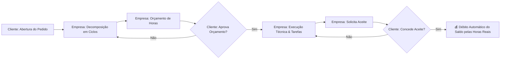

<div align="center">

# ⏱️ SHM — Support Hours Manager 2.1

**Main Release 2.1 — Plataforma de Alta Governança para Orçamento, Execução e Aceite de Horas Técnicas em Contratos de Suporte**

[](https://www.djangoproject.com/)
[](https://react.dev/)
[](https://www.typescriptlang.org/)
[](https://vitejs.dev/)
[](https://tailwindcss.com/)
[](http://localhost:8000/api/docs/)
[](https://docs.pytest.org/)

[Visão Geral](#-visão-geral) • [Regras de Negócio](#-regras-de-ouro-do-domínio) • [Arquitetura](#-arquitetura-do-sistema) • [Começando](#-como-executar) • [Credenciais Demo](#-credenciais-de-demonstração) • [Documentação](#-documentação-detalhada)

---

</div>

## 📌 Visão Geral

O **SHM (Support Hours Manager)** é uma solução desenhada para resolver os gargalos de transparência e atrito na gestão de contratos de suporte e consultoria técnica de TI.

Diferente de sistemas convencionais de chamados que misturam horas orçadas com horas faturadas, o **SHM 2.0** introduz o conceito de **Decomposição Atômica em Ciclos**, **Ledger Imutável de Saldo** e aprovação simplificada via **Magic Links**.



---

## 💎 Regras de Ouro do Domínio

1. **Hierarquia Estrutural**:
   - **Cliente (PF/PJ)** $\rightarrow$ Possui 1 ou mais **Contratos**.
   - **Contrato (`CT-YYYY-NNNN`)** $\rightarrow$ Controla franquia contratada, vigência, carência de 30 dias pós-expiração e saldo.
   - **Pedido de Suporte (`OSYYYYMMNNNN`)** $\rightarrow$ Demanda ampla aberta pelo cliente.
   - **Ciclos de Atendimento** $\rightarrow$ Recortes atômicos classificados em:
     - `Corretiva`, `Evolutiva`, `Preventiva`, `Análise`, `Consultoria`, `Treinamento`.
   - **Tarefas** $\rightarrow$ Apontamentos de horas executadas pelo técnico dentro do ciclo.

2. **Débito de Saldo Exclusivamente no Aceite**:
   - A aprovação do orçamento **não consome saldo** do contrato (evita travar horas em demandas que sofram alterações de escopo).
   - O débito ocorre **apenas no Aceite Formal do Ciclo** pelo cliente, debitando o total de **horas reais realizadas** (`horas_realizadas`).

3. **Ledger Imutável de Auditoria (`HistoricoSaldo`)**:
   - Toda movimentação de saldo (Consumo, Transferência entre contratos do mesmo cliente, Reabastecimento, Estorno) gera um registro imutável com carimbo temporal e autor responsável.

4. **Magic Links Públicos (Zero Atrito)**:
   - Links com token UUID único são disparados para tomadores/diretores aprovarem orçamentos e assinarem aceites em 1 clique direto pelo smartphone ou navegador, sem necessidade de autenticação.

---

## 🏛️ Arquitetura do Sistema

```
projeto-SHM/
├── backend/                  # Django 5 REST Framework
│   ├── apps/
│   │   ├── accounts/         # Usuários customizados e RBAC (Empresa vs Cliente)
│   │   ├── clientes/         # Cadastro PF/PJ com validação de CPF/CNPJ
│   │   ├── contratos/        # Gestão contratual, carência e extratos
│   │   ├── pedidos/          # Protocolos OS, agrupador de chamados
│   │   ├── ciclos/           # Workflow de ciclos, estados e Magic Links
│   │   ├── tarefas/          # Apontamento técnico de esforço e horas reais
│   │   ├── saldo/            # Ledger imutável, transferências e estornos
│   │   ├── comunicacao/      # Thread de comentários e conversão em tarefas
│   │   ├── notificacoes/     # Notificações in-app e eventos de timeline
│   │   └── core/             # Middlewares, permissions e comando seed_demo_data
│   ├── config/               # Settings, JWT, URLs e OpenAPI Swagger
│   └── tests/                # Suíte de testes unitários e de integração
│
├── frontend/                 # React 19 + TypeScript + Vite + Tailwind CSS
│   └── src/
│       ├── api/              # Cliente Axios com interceptors JWT e auto-refresh
│       ├── components/
│       │   ├── layout/       # Header, Sidebar de Contratos, AppLayout
│       │   ├── kanban/       # Kanban Board responsivo de 6 colunas
│       │   └── ciclos/       # Carrossel navegável de ciclos e comentários
│       ├── contexts/         # AuthContext com controle de permissões
│       ├── pages/            # Login, Dashboards, Detalhe, Novo Pedido, Magic Link
│       └── types/            # Tipos e interfaces estritas TypeScript
│
├── docs/                     # Documentação de API, Workflow e Arquitetura
└── relatorio-legado/         # Dossiê forense e histórico de extração do legado
```

---

## 🚀 Como Executar

### 1. Pré-requisitos
- **Python 3.11+**
- **Node.js 20+** ou **Bun 1.2+**
- **Git**

### 2. Backend (API REST)
```bash
# 1. Crie e ative o ambiente virtual
uv venv .venv
# No Windows PowerShell:
.\.venv\Scripts\activate

# 2. Instale as dependências
uv pip install -r backend/requirements.txt --python .venv\Scripts\python.exe

# 3. Execute as migrações do banco de dados
.\.venv\Scripts\python.exe backend/manage.py migrate

# 4. Popule com dados de demonstração
.\.venv\Scripts\python.exe backend/manage.py seed_demo_data

# 5. Inicie o servidor Django
.\.venv\Scripts\python.exe backend/manage.py runserver 8000
```
- 📖 **Swagger OpenAPI UI**: [http://localhost:8000/api/docs/](http://localhost:8000/api/docs/)
- ⚙️ **Painel Administrativo Django**: [http://localhost:8000/admin/](http://localhost:8000/admin/)

---

### 3. Frontend (Web App)
```bash
# 1. Acesse a pasta do frontend
cd frontend

# 2. Instale as dependências
bun install   # ou npm install

# 3. Inicie o servidor de desenvolvimento
bun run dev   # ou npm run dev
```
- 🌐 **Aplicação Web**: [http://localhost:5173](http://localhost:5173)

---

## 🔑 Credenciais de Demonstração

| Perfil | Usuário | Senha | Papel no Sistema |
| :--- | :--- | :--- | :--- |
| **Cliente Gerente** | `gerente.acme` | `cliente123` | Tomador da Acme Corp. Aprova orçamentos e concede aceites finais. |
| **Cliente Analista** | `analista.acme` | `cliente123` | Usuário solicitante da Acme Corp. Abre pedidos e acompanha kanban. |
| **Empresa Admin** | `admin` | `admin123` | Administrador prestador. Gestão geral de contratos, saldos e clientes. |
| **Empresa Técnico** | `tecnico` | `tecnico123` | Operador técnico. Triagem, estimativa de ciclos e apontamento de tarefas. |

---

## 🧪 Testes Automatizados

### Backend (Pytest)
```bash
.\.venv\Scripts\python.exe -m pytest backend/tests
```

### Frontend (Build & Type-Check)
```bash
cd frontend && bun run build
```

---

## 📚 Documentação Detalhada

- 🏛️ [Arquitetura & Modelagem de Dados](ARCHITECTURE.md)
- 🔌 [Referência Completa da API REST](docs/API.md)
- 🔄 [Guia do Workflow e Ciclos de Atendimento](docs/WORKFLOW.md)
- 🤝 [Guia de Contribuição](CONTRIBUTING.md)
- 📂 [Dossiê e Post-Mortem do Legado](relatorio-legado/README.md)

---

## 📄 Licença

Este projeto é desenvolvido sob a licença MIT. Consulte o arquivo `LICENSE` para mais detalhes.