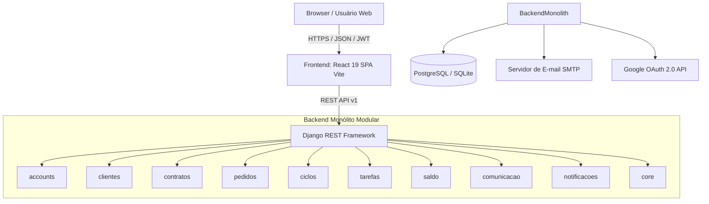

# Arquitetura Geral do Sistema — SHM 2.5.0

> Gerado pelo **Reversa Architect** em 2026-09-03  
> Sistema: **SHM 2.5.0 (Support Hours Manager)**

---

## 1. Visão Arquitetural

O **SHM 2.5.0** adota o modelo de **Monólito Modular no Backend** (Django Apps com separação estrita de responsabilidades por domínios) e **Single Page Application (SPA) desacoplada no Frontend** (React 19 + TypeScript).

---

## 2. Padrões de Projeto e Diretrizes

1. **Service Layer Pattern:** A lógica de negócio e as orquestrações transacionais residem nas classes `*Service` (ex: `SaldoService`, `CicloService`, `ContratoService`, `PedidoService`), mantendo as Views do DRF enxutas e focadas em validação HTTP e serialização.
2. **Isolamento ACID & Locks Pessimistas:** Operações contábeis que alteram saldo ou transferem horas entre contratos utilizam `select_for_update()` com ordenação estrita de IDs (`_obter_par_contratos_com_lock_ordenado`) para garantir consistência e imunidade a deadlocks.
3. **Desacoplamento por Eventos/Notificações:** Transições de status de ciclos, alertas de saldo e eventos contratuais delegam o disparo para o `NotificacaoService`, desacoplando a regra de negócio da entrega multicanal.
4. **Armazenamento de Provas Criptográficas:** Uploads contratuais persistem o hash SHA-256 no banco e o arquivo físico em storage, viabilizando conferência forense a qualquer tempo.
