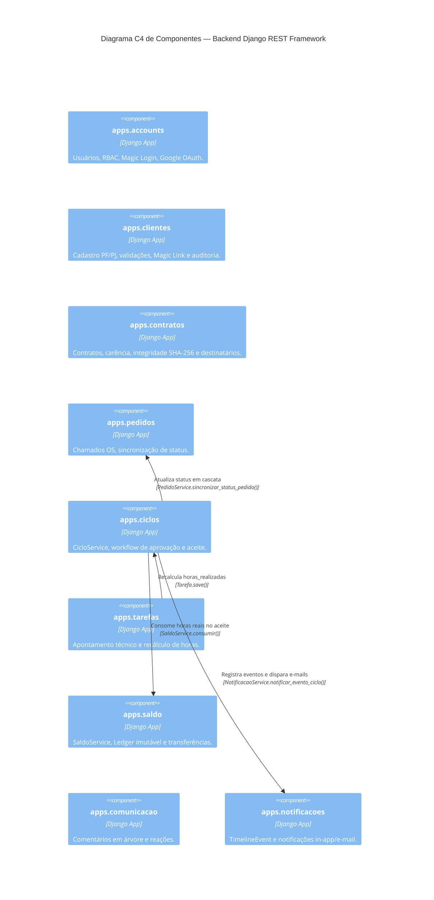

# Diagrama C4 — Componentes do Backend (Nível 3)

```mermaid
C4Component
    title Diagrama C4 de Componentes — Backend Django REST Framework

    Component(accounts, "apps.accounts", "Django App", "Usuários, RBAC, Magic Login, Google OAuth.")
    Component(clientes, "apps.clientes", "Django App", "Cadastro PF/PJ, validações, Magic Link e auditoria.")
    Component(contratos, "apps.contratos", "Django App", "Contratos, carência, integridade SHA-256 e destinatários.")
    Component(pedidos, "apps.pedidos", "Django App", "Chamados OS, sincronização de status.")
    Component(ciclos, "apps.ciclos", "Django App", "CicloService, workflow de aprovação e aceite.")
    Component(tarefas, "apps.tarefas", "Django App", "Apontamento técnico e recálculo de horas.")
    Component(saldo, "apps.saldo", "Django App", "SaldoService, Ledger imutável e transferências.")
    Component(comunicacao, "apps.comunicacao", "Django App", "Comentários em árvore e reações.")
    Component(notificacoes, "apps.notificacoes", "Django App", "TimelineEvent e notificações in-app/e-mail.")

    Rel(ciclos, saldo, "Consome horas reais no aceite", "SaldoService.consumir()")
    Rel(ciclos, pedidos, "Atualiza status em cascata", "PedidoService.sincronizar_status_pedido()")
    Rel(tarefas, ciclos, "Recalcula horas_realizadas", "Tarefa.save()")
    Rel(ciclos, notificacoes, "Registra eventos e dispara e-mails", "NotificacaoService.notificar_evento_ciclo()")
```