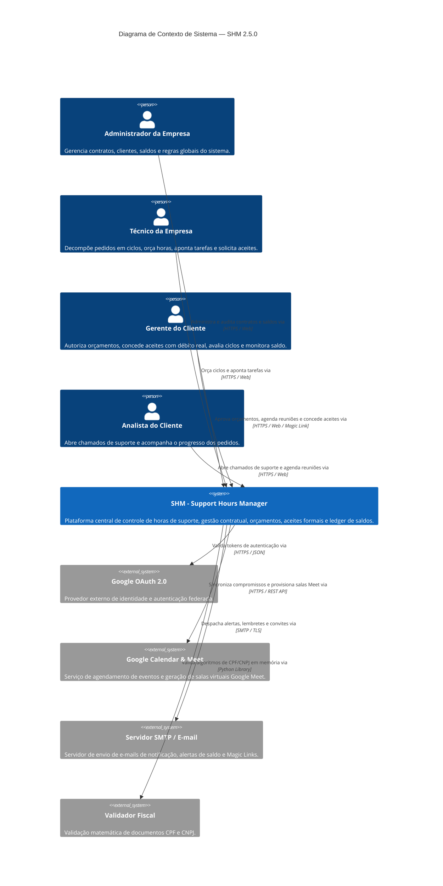

# Diagrama C4 — Contexto do Sistema (Nível 1)

```mermaid
C4Context
    title Diagrama de Contexto de Sistema — SHM 2.5.0

    Person(admin, "Administrador da Empresa", "Gerencia contratos, clientes, saldos e regras globais do sistema.")
    Person(tecnico, "Técnico da Empresa", "Decompõe pedidos em ciclos, orça horas, aponta tarefas e solicita aceites.")
    Person(gerente, "Gerente do Cliente", "Autoriza orçamentos, concede aceites com débito real, avalia ciclos e monitora saldo.")
    Person(analista, "Analista do Cliente", "Abre chamados de suporte e acompanha o progresso dos pedidos.")

    System(shm, "SHM - Support Hours Manager", "Plataforma central de controle de horas de suporte, gestão contratual, orçamentos, aceites formais e ledger de saldos.")

    System_Ext(google_auth, "Google OAuth 2.0", "Provedor externo de identidade e autenticação federada.")
    System_Ext(google_calendar, "Google Calendar & Meet", "Serviço de agendamento de eventos e geração de salas virtuais Google Meet.")
    System_Ext(smtp, "Servidor SMTP / E-mail", "Servidor de envio de e-mails de notificação, alertas de saldo e Magic Links.")
    System_Ext(docs_validator, "Validador Fiscal", "Validação matemática de documentos CPF e CNPJ.")

    Rel(admin, shm, "Administra e audita contratos e saldos via", "HTTPS / Web")
    Rel(tecnico, shm, "Orça ciclos e aponta tarefas via", "HTTPS / Web")
    Rel(gerente, shm, "Aprova orçamentos, agenda reuniões e concede aceites via", "HTTPS / Web / Magic Link")
    Rel(analista, shm, "Abre chamados de suporte e agenda reuniões via", "HTTPS / Web")

    Rel(shm, google_auth, "Valida tokens de autenticação via", "HTTPS / JSON")
    Rel(shm, google_calendar, "Sincroniza compromissos e provisiona salas Meet via", "HTTPS / REST API")
    Rel(shm, smtp, "Despacha alertas, lembretes e convites via", "SMTP / TLS")
    Rel(shm, docs_validator, "Valida algoritmos de CPF/CNPJ em memória via", "Python Library")
```
