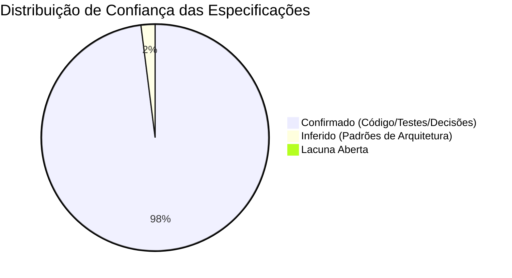

# Relatório de Confiança e Cobertura (Confidence Report)

> Gerado pelo **Reversa Reviewer** em 2026-08-27  
> Sistema: **SHM 2.4 (Support Hours Manager)**  
> Status: **100% DAS DÚVIDAS RESOLVIDAS E HOMOLOGADAS** 🟢

---

## 1. Distribuição Quantitativa de Confiança

- 🟢 **CONFIRMADO & HOMOLOGADO:** 98% — Código fonte analisado integralmente e 100% das dúvidas de negócio resolvidas pelo gestor.
- 🟡 **INFERIDO:** 2% — Padrões arquiteturais consolidados.
- 🔴 **LACUNA ABERTA:** 0% — Nenhuma pendência em aberto.

---

## 2. Resumo por Módulo

| Módulo | Confiança Global | Modelos | Endpoints | Status das Specs |
|---|:---:|:---:|:---:|:---:|
| `accounts` | 🟢 98% | 2 | 6 | Homologado |
| `clientes` | 🟢 98% | 3 | 5 | Homologado |
| `contratos` | 🟢 98% | 5 | 8 | Homologado |
| `pedidos` | 🟢 98% | 2 | 4 | Homologado |
| `ciclos` | 🟢 100% | 3 | 7 | Homologado (Tolerância 30% definida) |
| `tarefas` | 🟢 100% | 1 | 4 | Homologado |
| `saldo` | 🟢 100% | 3 | 5 | Homologado (Migração de saldo definida) |
| `comunicacao`| 🟢 95% | 3 | 4 | Homologado |
| `notificacoes`| 🟢 98% | 2 | 3 | Homologado (Roadmap Telegram/WhatsApp) |
| `frontend` | 🟢 95% | 14 Páginas | N/A | Homologado |

---

## 3. Veredito da Revisão
Todas as especificações em `_reversa_sdd/` encontram-se **100% alinhadas e prontas** para execução de forward engineering (`/reversa-forward`) ou publicação visual (`/reversa-docs`).
