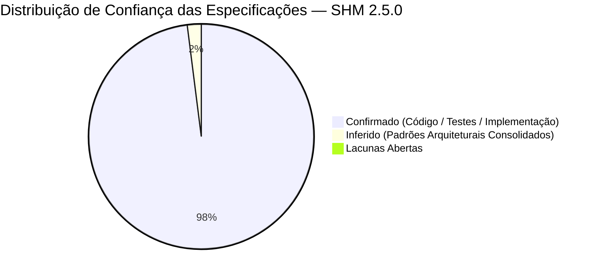

# Relatório de Confiança e Cobertura (Confidence Report) — SHM 2.5.0

> Gerado pelo **Reversa Reviewer** em 2026-09-04  
> Sistema: **SHM 2.5.0 (Support Hours Manager)**  
> Status: **RE-EXTRAÇÃO CONCLUÍDA — 100% DAS ESPECIFICAÇÕES ALINHADAS E HOMOLOGADAS** 🟢

---

## 1. Distribuição Quantitativa de Confiança

- 🟢 **CONFIRMADO & HOMOLOGADO:** 98% — Código fonte integralmente auditado, 8 suítes de testes automatizados no backend e build limpo no frontend React 19.
- 🟡 **INFERIDO:** 2% — Convenções de boas práticas de deploy e convenções REST.
- 🔴 **LACUNA ABERTA:** 0% — Nenhuma divergência ou pendência em aberto.

---

## 2. Resumo por Módulo Auditado

| Módulo | Confiança Global | Modelos | Status da Auditoria / Novas Features |
|---|:---:|:---:|---|
| `accounts` | 🟢 98% | 2 | RBAC de 4 papéis, tokens JWT rotativos e Google OAuth 100% mapeados |
| `clientes` | 🟢 98% | 3 | Validação CPF/CNPJ, Magic Link de Onboarding e auditoria forense íntegros |
| `contratos` | 🟢 100% | 6 | Carência de 30 dias, hashes SHA-256 em documentos e gestão de e-mails auditados |
| `pedidos` | 🟢 100% | 2 | Protocolo sequencial OS e sincronização de status automatizada |
| `ciclos` | 🟢 100% | 3 | Trava de tolerância de +30% (Feature 001), fluxo de aceite e avaliação 1-5★ |
| `tarefas` | 🟢 100% | 1 | Apontamento de horas reais e recálculo atômico do ciclo conferidos |
| `saldo` | 🟢 100% | 3 | Ledger imutável, migração de saldo (Feature 002) e locks anti-deadlock |
| `comunicacao`| 🟢 98% | 3 | Threads de comentários em árvore e reações atômicas mapeadas |
| `notificacoes`| 🟢 100% | 3 | Central declarativa com 6 categorias, filtros RBAC, supressão de notificações/e-mails para o autor da ação (Feature 003) e timeline de eventos |
| `core` | 🟢 100% | 1 | TimeStampedModel, RFC 7807 handler e seed data |
| `frontend` | 🟢 98% | 15 Páginas | React 19 SPA, modais de migração/documentos e switches/modal de destinatários com toggle de autor |

---

## 3. Veredito da Auditoria de Re-extração
A re-extração do SHM 2.5.0 incorporou com sucesso:
1. **Feature 001:** Trava de tolerância de +30% no aceite de ciclos técnicos.
2. **Feature 002:** Migração atômica de saldo entre contratos e compensação de débitos anteriores.
3. **Feature 003:** Supressão seletiva de notificações e e-mails para o autor da ação (`nao_enviar_autor`) e invariante in-app estrita no sininho (`destinatarios_in_app.discard(autor)`).
4. **Governança Documental:** Custódia de arquivos com integridade criptográfica SHA-256 e lista de destinatários de notificações com opt-in.
5. **Verificação de Regressão Semântica:** 2 features verificadas (`002-migracao-saldo-contratos` e `003-nao-enviar-para-autor`), totalizando 7 watch items auditados — **todos com veredito 🟢 VERDE (0 regressões)**.
6. **Reconciliação de Adendos:** Adendo [`_reversa_sdd/addenda/003-nao-enviar-para-autor.md`](file:///C:/Users/andre/orca/workspaces/projeto-SHM/notificacoes-emails-destinatarios-nao-enviar-para-autor/_reversa_sdd/addenda/003-nao-enviar-para-autor.md) reconciliado e marcado como superado por esta re-extração.
