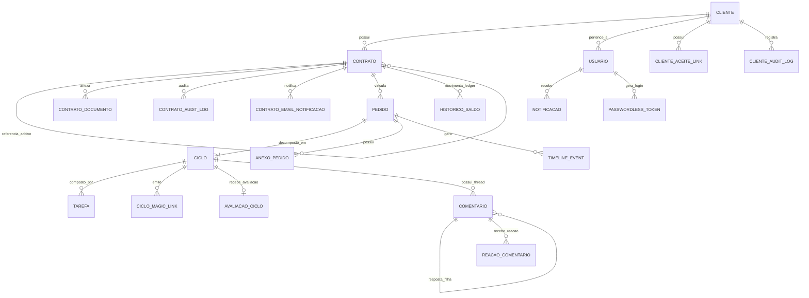

# Diagrama Entidade-Relacionamento Completo (ERD) — SHM 2.4

```mermaid
erDiagram
    CLIENTE ||--o{ CONTRATO : "possui"
    CLIENTE ||--o{ USUARIO : "pertence_a"
    CLIENTE ||--o{ CLIENTE_ACEITE_LINK : "possui"
    CLIENTE ||--o{ CLIENTE_AUDIT_LOG : "registra"

    CONTRATO ||--o{ CONTRATO : "referencia_aditivo"
    CONTRATO ||--o{ CONTRATO_DOCUMENTO : "anexa"
    CONTRATO ||--o{ CONTRATO_AUDIT_LOG : "audita"
    CONTRATO ||--o{ CONTRATO_EMAIL_NOTIFICACAO : "notifica"
    CONTRATO ||--o{ PEDIDO : "vincula"
    CONTRATO ||--o{ HISTORICO_SALDO : "movimenta_ledger"

    PEDIDO ||--|{ CICLO : "decomposto_em"
    PEDIDO ||--o{ ANEXO_PEDIDO : "possui"
    PEDIDO ||--o{ TIMELINE_EVENT : "gera"

    CICLO ||--o{ TAREFA : "composto_por"
    CICLO ||--o{ CICLO_MAGIC_LINK : "emite"
    CICLO ||--o| AVALIACAO_CICLO : "recebe_avaliacao"
    CICLO ||--o{ COMENTARIO : "possui_thread"

    COMENTARIO ||--o{ COMENTARIO : "resposta_filha"
    COMENTARIO ||--o{ REACAO_COMENTARIO : "recebe_reacao"

    USUARIO ||--o{ NOTIFICACAO : "recebe"
    USUARIO ||--o{ PASSWORDLESS_TOKEN : "gera_login"
```