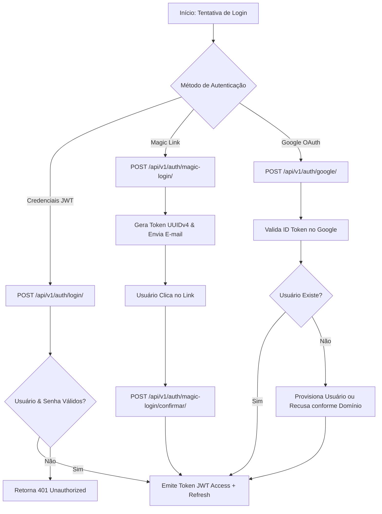

# Fluxograma do Módulo Accounts

```mermaid
flowchart TD
    A[Início: Tentativa de Login] --> B{Método de Autenticação}
    B -->|Credenciais JWT| C[POST /api/v1/auth/login/]
    B -->|Magic Link| D[POST /api/v1/auth/magic-login/]
    B -->|Google OAuth| E[POST /api/v1/auth/google/]
    C --> F{Usuário & Senha Válidos?}
    F -- Sim --> G[Emite Token JWT Access + Refresh]
    F -- Não --> H[Retorna 401 Unauthorized]
    D --> I[Gera Token UUIDv4 & Envia E-mail]
    I --> J[Usuário Clica no Link]
    J --> K[POST /api/v1/auth/magic-login/confirmar/]
    K --> G
    E --> L[Valida ID Token no Google]
    L --> M{Usuário Existe?}
    M -- Sim --> G
    M -- Não --> N[Provisiona Usuário ou Recusa conforme Domínio]
    N --> G
```
