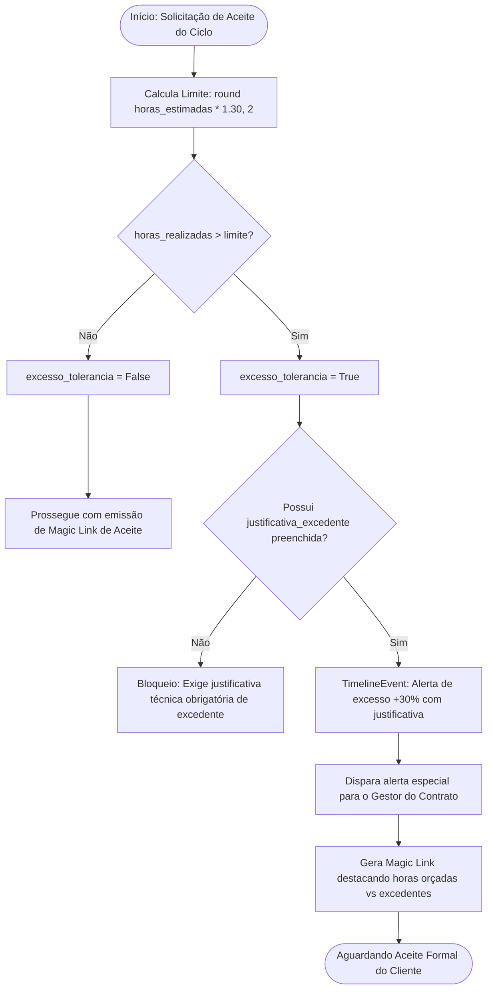

# Fluxograma — Ciclos: `validar_tolerancia_horas` & Trava de Tolerância

```mermaid
flowchart TD
    Start([Início: Solicitação de Aceite do Ciclo]) --> CalcLimite[Calcula Limite: round horas_estimadas * 1.30, 2]
    CalcLimite --> ComparaHoras{horas_realizadas > limite?}
    
    ComparaHoras -- Não --> ToleranciaOk[excesso_tolerancia = False]
    ComparaHoras -- Sim --> ToleranciaExcedida[excesso_tolerancia = True]
    
    ToleranciaOk --> SegueAceite[Prossegue com emissão de Magic Link de Aceite]
    
    ToleranciaExcedida --> ChecaJustificativa{Possui justificativa_excedente preenchida?}
    ChecaJustificativa -- Não --> BloqueioTrava[Bloqueio: Exige justificativa técnica obrigatória de excedente]
    ChecaJustificativa -- Sim --> RegistraAlerta[TimelineEvent: Alerta de excesso +30% com justificativa]
    
    RegistraAlerta --> NotificaGestor[Dispara alerta especial para o Gestor do Contrato]
    NotificaGestor --> EmiteMagicLink[Gera Magic Link destacando horas orçadas vs excedentes]
    EmiteMagicLink --> Fim([Aguardando Aceite Formal do Cliente])
```
