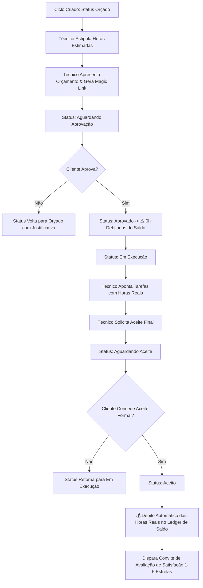

# Fluxograma do Módulo Ciclos

```mermaid
flowchart TD
    A[Ciclo Criado: Status Orçado] --> B[Técnico Estipula Horas Estimadas]
    B --> C[Técnico Apresenta Orçamento & Gera Magic Link]
    C --> D[Status: Aguardando Aprovação]
    D --> E{Cliente Aprova?}
    E -- Não --> F[Status Volta para Orçado com Justificativa]
    E -- Sim --> G[Status: Aprovado -> ⚠️ 0h Debitadas do Saldo]
    G --> H[Status: Em Execução]
    H --> I[Técnico Aponta Tarefas com Horas Reais]
    I --> J[Técnico Solicita Aceite Final]
    J --> K[Status: Aguardando Aceite]
    K --> L{Cliente Concede Aceite Formal?}
    L -- Não --> M[Status Retorna para Em Execução]
    L -- Sim --> N[Status: Aceito]
    N --> O[💰 Débito Automático das Horas Reais no Ledger de Saldo]
    O --> P[Dispara Convite de Avaliação de Satisfação 1-5 Estrelas]
```
