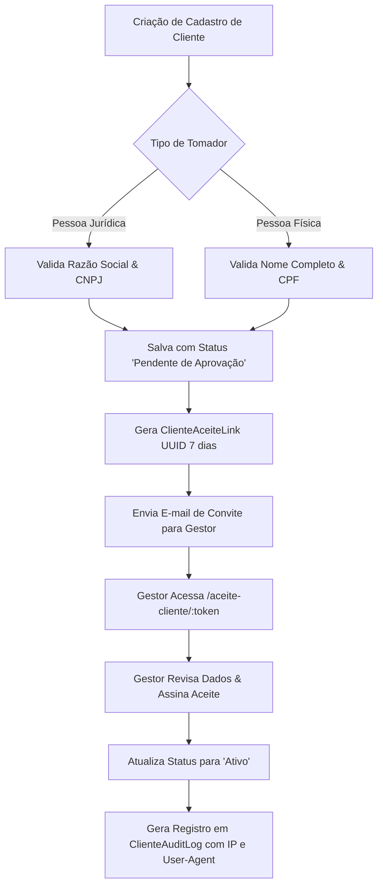

# Fluxograma do Módulo Clientes

```mermaid
flowchart TD
    A[Criação de Cadastro de Cliente] --> B{Tipo de Tomador}
    B -->|Pessoa Jurídica| C[Valida Razão Social & CNPJ]
    B -->|Pessoa Física| D[Valida Nome Completo & CPF]
    C --> E[Salva com Status 'Pendente de Aprovação']
    D --> E
    E --> F[Gera ClienteAceiteLink UUID 7 dias]
    F --> G[Envia E-mail de Convite para Gestor]
    G --> H[Gestor Acessa /aceite-cliente/:token]
    H --> I[Gestor Revisa Dados & Assina Aceite]
    I --> J[Atualiza Status para 'Ativo']
    J --> K[Gera Registro em ClienteAuditLog com IP e User-Agent]
```
