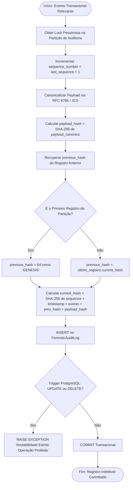

# Fluxograma de Função: Encadeamento de Hashes (RFC 8785 & SHA-256)

> Módulo: `contratos`  
> Serviço: `ForensicAuditService.registrar_evento()`  
> Padrões: RFC 8785 (JSON Canonicalization Scheme) + FIPS 180-4 (SHA-256) + CPP Arts. 158-A a F  

