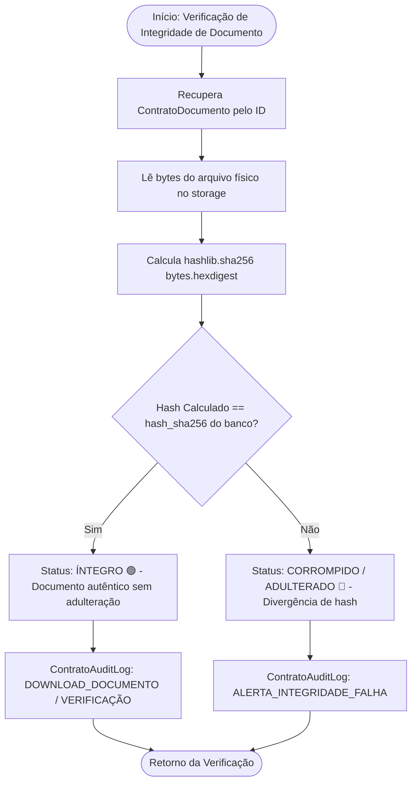

# Fluxograma — Contratos: Verificação de Integridade Criptográfica (SHA-256)

```mermaid
flowchart TD
    Start([Início: Verificação de Integridade de Documento]) --> BuscaDoc[Recupera ContratoDocumento pelo ID]
    BuscaDoc --> LeArquivoDisco[Lê bytes do arquivo físico no storage]
    LeArquivoDisco --> CalculaSha[Calcula hashlib.sha256 bytes.hexdigest]
    CalculaSha --> ComparaHash{Hash Calculado == hash_sha256 do banco?}
    
    ComparaHash -- Sim --> Valido[Status: ÍNTEGRO 🟢 - Documento autêntico sem adulteração]
    ComparaHash -- Não --> Invalido[Status: CORROMPIDO / ADULTERADO 🔴 - Divergência de hash]
    
    Valido --> AuditLog[ContratoAuditLog: DOWNLOAD_DOCUMENTO / VERIFICAÇÃO]
    Invalido --> AuditAlerta[ContratoAuditLog: ALERTA_INTEGRIDADE_FALHA]
    AuditLog --> Fim([Retorno da Verificação])
    AuditAlerta --> Fim
```
