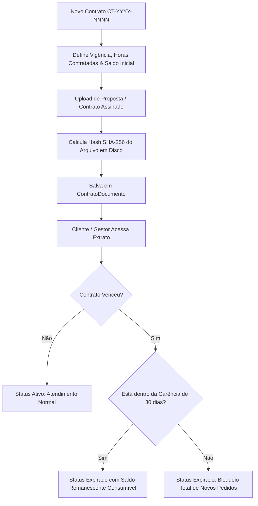

# Fluxograma do Módulo Contratos

```mermaid
flowchart TD
    A[Novo Contrato CT-YYYY-NNNN] --> B[Define Vigência, Horas Contratadas & Saldo Inicial]
    B --> C[Upload de Proposta / Contrato Assinado]
    C --> D[Calcula Hash SHA-256 do Arquivo em Disco]
    D --> E[Salva em ContratoDocumento]
    E --> F[Cliente / Gestor Acessa Extrato]
    F --> G{Contrato Venceu?}
    G -- Não --> H[Status Ativo: Atendimento Normal]
    G -- Sim --> I{Está dentro da Carência de 30 dias?}
    I -- Sim --> J[Status Expirado com Saldo Remanescente Consumível]
    I -- Não --> K[Status Expirado: Bloqueio Total de Novos Pedidos]
```
