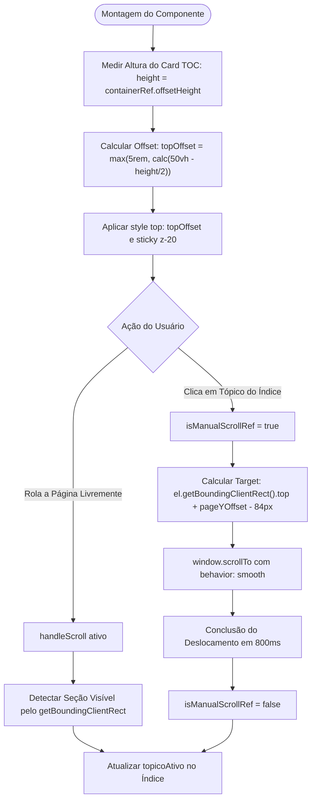

# Fluxograma de Função: Índice Flutuante Fixo Centralizado e Scroll Suave

> Módulo: `frontend`  
> Componentes: `DocumentacaoAuditoriaPage.tsx` + `DocumentacaoSidebarTOC.tsx`  
> Comportamento: Posicionamento vertical viewport-centered e deslocamento amortecido  

