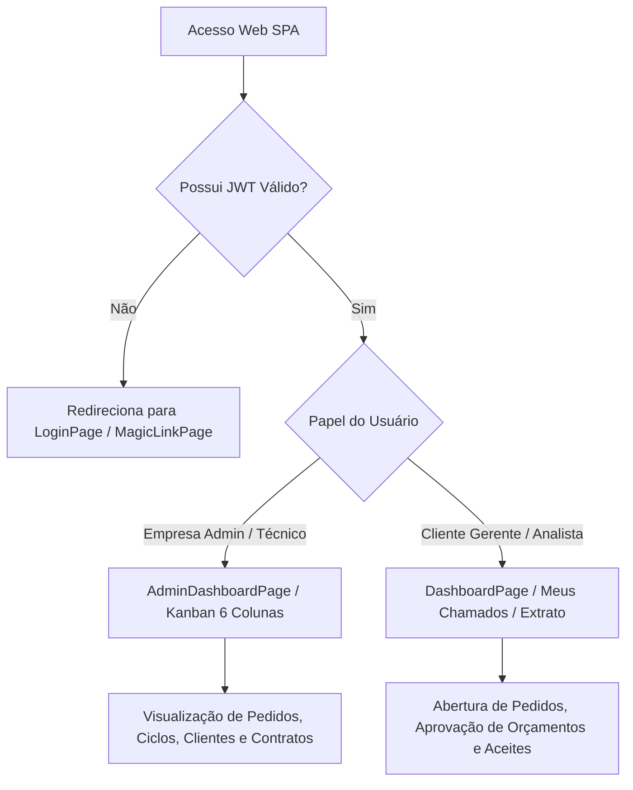

# Fluxograma do Módulo Frontend

```mermaid
flowchart TD
    A[Acesso Web SPA] --> B{Possui JWT Válido?}
    B -- Não --> C[Redireciona para LoginPage / MagicLinkPage]
    B -- Sim --> D{Papel do Usuário}
    D -->|Empresa Admin / Técnico| E[AdminDashboardPage / Kanban 6 Colunas]
    D -->|Cliente Gerente / Analista| F[DashboardPage / Meus Chamados / Extrato]
    E --> G[Visualização de Pedidos, Ciclos, Clientes e Contratos]
    F --> H[Abertura de Pedidos, Aprovação de Orçamentos e Aceites]
```
