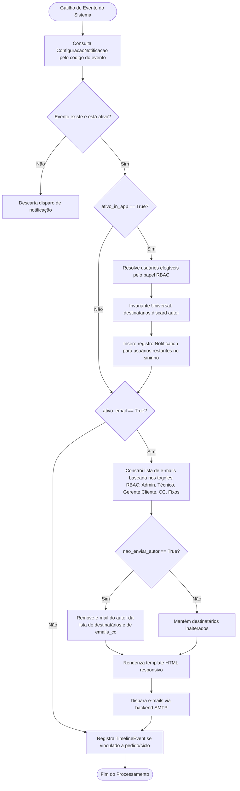

# Fluxograma — Notificações: Despacho Declarativo e Supressão para o Autor da Ação

```mermaid
flowchart TD
    Trigger([Gatilho de Evento do Sistema]) --> BuscaConfig[Consulta ConfiguracaoNotificacao pelo código do evento]
    BuscaConfig --> ConfigAtiva{Evento existe e está ativo?}
    
    ConfigAtiva -- Não --> Aborta[Descarta disparo de notificação]
    ConfigAtiva -- Sim --> AvaliaInApp{ativo_in_app == True?}
    
    AvaliaInApp -- Sim --> ResolveInApp[Resolve usuários elegíveis pelo papel RBAC]
    ResolveInApp --> InvarianteInApp[Invariante Universal: destinatarios.discard autor]
    InvarianteInApp --> CriaNotification[Insere registro Notification para usuários restantes no sininho]
    AvaliaInApp -- Não --> AvaliaEmail
    CriaNotification --> AvaliaEmail{ativo_email == True?}
    
    AvaliaEmail -- Não --> Timeline[Registra TimelineEvent se vinculado a pedido/ciclo]
    
    AvaliaEmail -- Sim --> MontaLista[Constrói lista de e-mails baseada nos toggles RBAC: Admin, Técnico, Gerente Cliente, CC, Fixos]
    MontaLista --> ChecaNaoEnviarAutor{nao_enviar_autor == True?}
    
    ChecaNaoEnviarAutor -- Sim --> ExpurgarAutor[Remove e-mail do autor da lista de destinatários e de emails_cc]
    ChecaNaoEnviarAutor -- Não --> MantemLista[Mantém destinatários inalterados]
    
    ExpurgarAutor --> RenderTemplate[Renderiza template HTML responsivo]
    MantemLista --> RenderTemplate
    RenderTemplate --> EnviaSMTP[Dispara e-mails via backend SMTP]
    EnviaSMTP --> Timeline
    Timeline --> Fim([Fim do Processamento])
```
