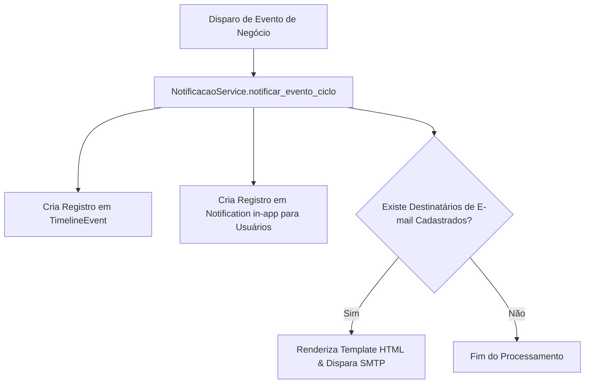

# Fluxograma do Módulo Notificações

```mermaid
flowchart TD
    A[Disparo de Evento de Negócio] --> B[NotificacaoService.notificar_evento_ciclo]
    B --> C[Cria Registro em TimelineEvent]
    B --> D[Cria Registro em Notification in-app para Usuários]
    B --> E{Existe Destinatários de E-mail Cadastrados?}
    E -- Sim --> F[Renderiza Template HTML & Dispara SMTP]
    E -- Não --> G[Fim do Processamento]
```
