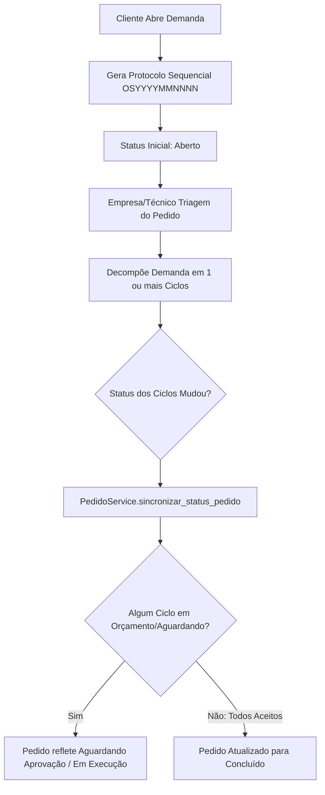

# Fluxograma do Módulo Pedidos

```mermaid
flowchart TD
    A[Cliente Abre Demanda] --> B[Gera Protocolo Sequencial OSYYYYMMNNNN]
    B --> C[Status Inicial: Aberto]
    C --> D[Empresa/Técnico Triagem do Pedido]
    D --> E[Decompõe Demanda em 1 ou mais Ciclos]
    E --> F{Status dos Ciclos Mudou?}
    F --> G[PedidoService.sincronizar_status_pedido]
    G --> H{Algum Ciclo em Orçamento/Aguardando?}
    H -- Sim --> I[Pedido reflete Aguardando Aprovação / Em Execução]
    H -- Não: Todos Aceitos --> J[Pedido Atualizado para Concluído]
```
