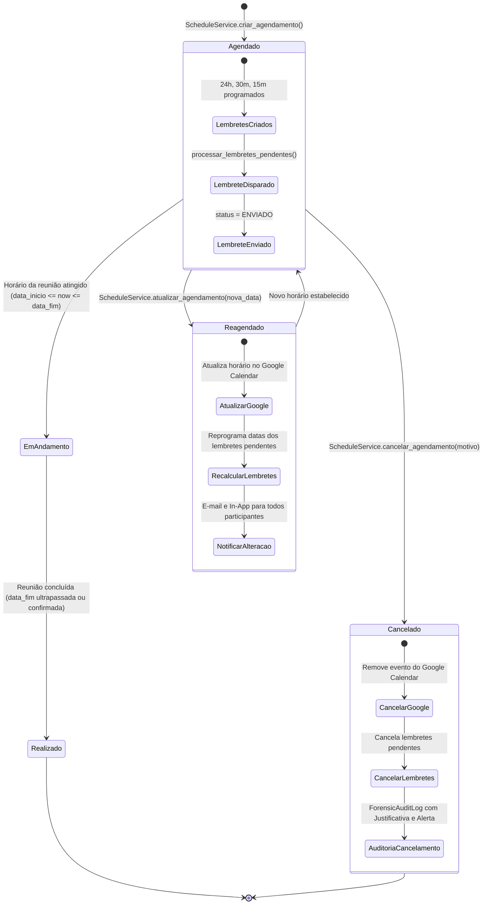

# Ciclo de Vida e Processamento de Lembretes do Agendamento (Schedule)

> Mapeamento de Engenharia Reversa — SHM 2.5  
> Escala de Confiança: 🟢 CONFIRMADO (Extraído de `backend/apps/schedule/services.py`)

