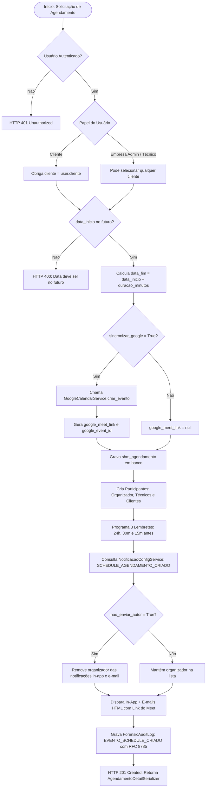

# Fluxograma do Módulo Schedule — Agendamento de Reuniões e Google Meet

> Mapeamento de Engenharia Reversa — SHM 2.5  
> Escala de Confiança: 🟢 CONFIRMADO (Extraído de `backend/apps/schedule/`)

```mermaid
flowchart TD
    Start([Início: Solicitação de Agendamento]) --> ValAuth{Usuário Autenticado?}
    ValAuth -- Não --> ErrAuth[HTTP 401 Unauthorized]
    ValAuth -- Sim --> ValRole{Papel do Usuário}

    ValRole -- Cliente --> RestrictClient[Obriga cliente = user.cliente]
    ValRole -- Empresa Admin / Técnico --> AllowAnyClient[Pode selecionar qualquer cliente]

    RestrictClient --> ValData{data_inicio no futuro?}
    AllowAnyClient --> ValData

    ValData -- Não --> ErrData[HTTP 400: Data deve ser no futuro]
    ValData -- Sim --> CalcTermino[Calcula data_fim = data_inicio + duracao_minutos]

    CalcTermino --> SyncGoogle{sincronizar_google = True?}
    SyncGoogle -- Sim --> GoogleCall[Chama GoogleCalendarService.criar_evento]
    GoogleCall --> GoogleMeet[Gera google_meet_link e google_event_id]
    SyncGoogle -- Não --> NoGoogle[google_meet_link = null]

    GoogleMeet --> CreateAgendamento[Grava shm_agendamento em banco]
    NoGoogle --> CreateAgendamento

    CreateAgendamento --> CreateParts[Cria Participantes: Organizador, Técnicos e Clientes]
    CreateParts --> CreateReminders[Programa 3 Lembretes: 24h, 30m e 15m antes]

    CreateReminders --> NotifGov[Consulta NotificacaoConfigService: SCHEDULE_AGENDAMENTO_CRIADO]
    NotifGov --> AuthorCheck{nao_enviar_autor = True?}
    AuthorCheck -- Sim --> SuppressAuthor[Remove organizador das notificações in-app e e-mail]
    AuthorCheck -- Não --> KeepAuthor[Mantém organizador na lista]

    SuppressAuthor --> DispatchNotifs[Dispara In-App + E-mails HTML com Link do Meet]
    KeepAuthor --> DispatchNotifs

    DispatchNotifs --> ForensicAudit[Grava ForensicAuditLog: EVENTO_SCHEDULE_CRIADO com RFC 8785]
    ForensicAudit --> ReturnSuccess[HTTP 201 Created: Retorna AgendamentoDetailSerializer]
```
