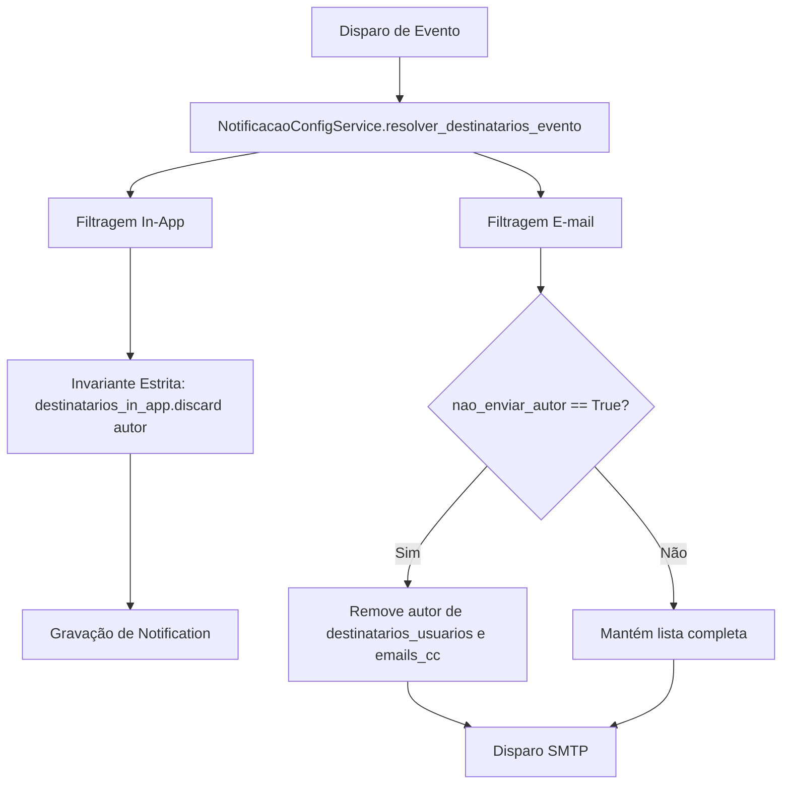

# Design do Módulo Notificações

> Gerado pelo **Reversa Writer** em 2026-09-04  
> Confiança: 🟢 CONFIRMADO

## 1. Modelos de Dados
- `TimelineEvent`: `pedido` (FK), `ciclo` (FK), `tipo`, `descricao`, `autor` (FK), `ip_origem`, `user_agent`, `timestamp`.
- `Notification`: `usuario` (FK), `titulo`, `mensagem`, `url`, `lida`, `criado_em`.
- `ConfiguracaoNotificacao`:
  - `codigo`: código único do evento (ex: `PEDIDO_CRIADO`, `COMENTARIO_CRIADO`).
  - `categoria`: `autenticacao`, `clientes`, `contratos`, `saldo`, `pedidos`, `ciclos`.
  - `nome`, `descricao`.
  - Canais: `ativo_email`, `ativo_in_app`.
  - Matriz RBAC: `notificar_empresa_admin`, `notificar_empresa_tecnico`, `notificar_cliente_gerente`, `notificar_cliente_comum`, `notificar_gestor_contrato`, `notificar_emails_cc`.
  - Listas e Regras: `emails_adicionais` (JSON), `bloqueado_edicao` (Boolean), `nao_enviar_autor` (Boolean, default=True).

## 2. Arquitetura de Resolução de Destinatários

## 3. Serviços Principais
- `NotificacaoService`: criação de notificações in-app, gravação de eventos na timeline e despacho multicanal.
- `NotificacaoConfigService`: inicialização de defaults (`CONFIGURACOES_PADRAO`), resolução estrita de destinatários e validações de regras.
