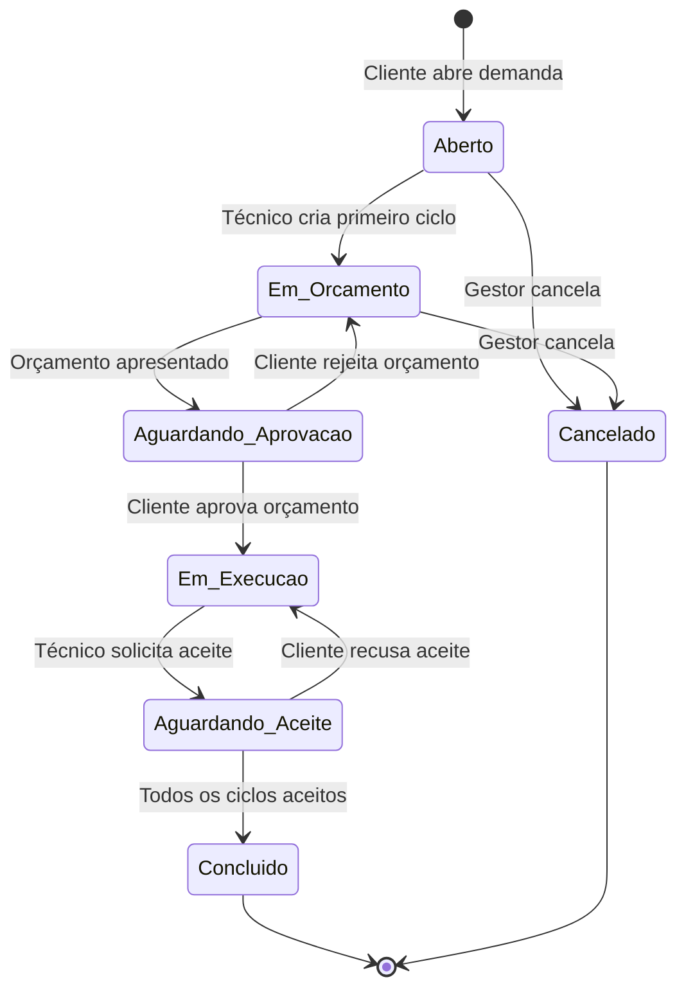
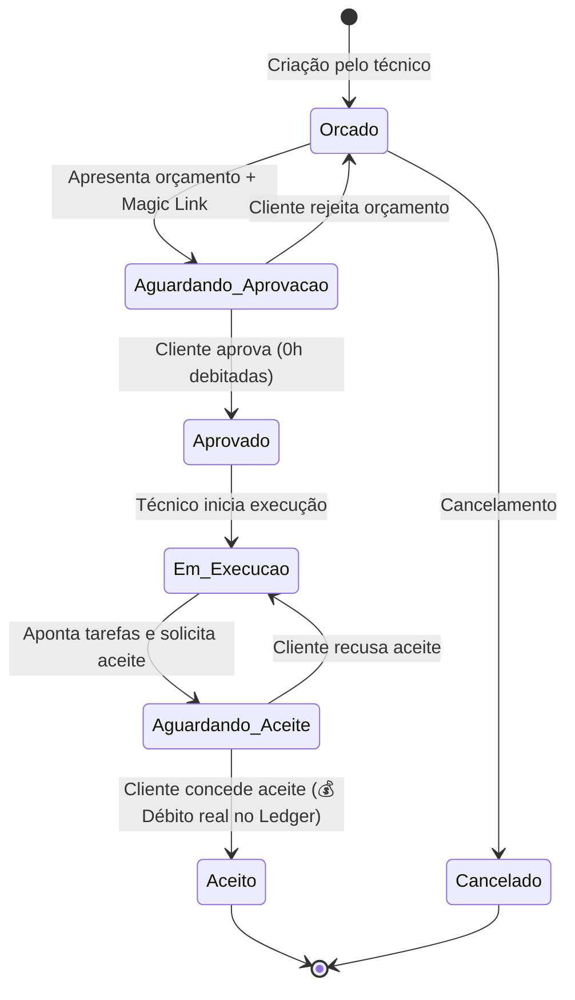
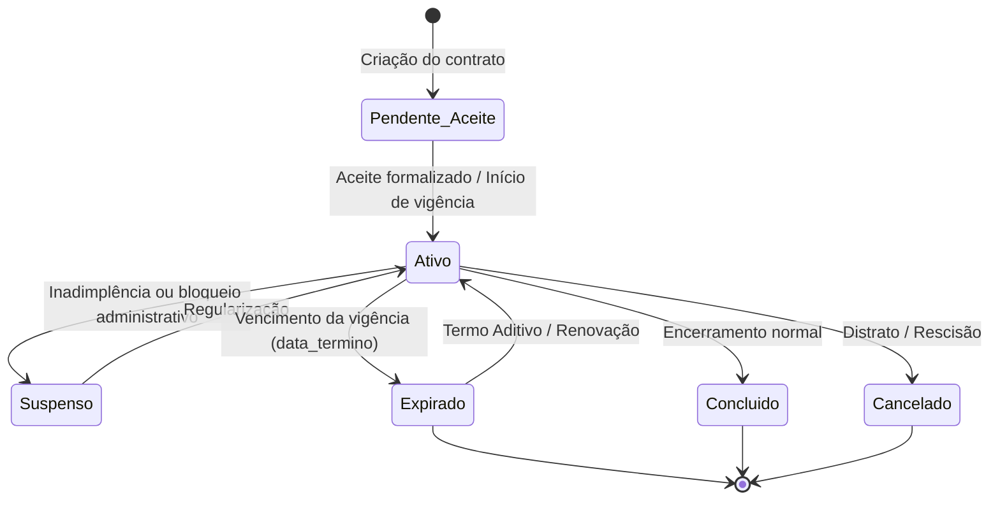
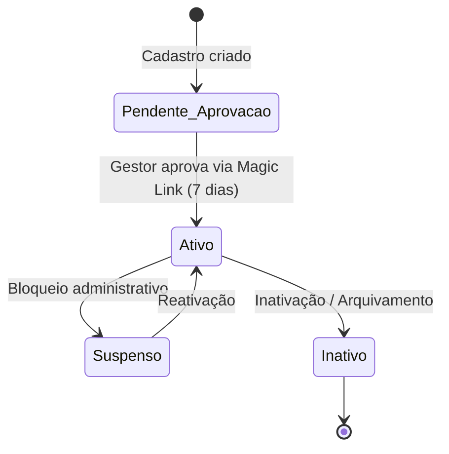

# Máquinas de Estado do Sistema — SHM 2.4

> Gerado pelo **Reversa Detective** em 2026-08-27

---

## 1. Ciclo de Vida do Pedido (Protocolo OS)

---

## 2. Ciclo de Vida do Ciclo de Atendimento

---

## 3. Ciclo de Vida do Contrato

---

## 4. Ciclo de Vida do Cliente

