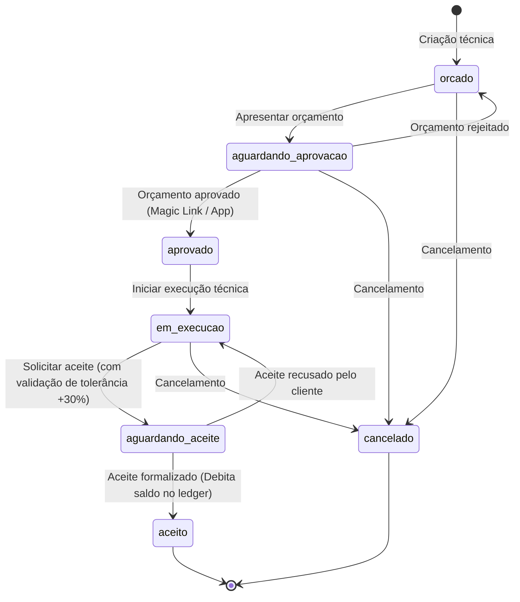
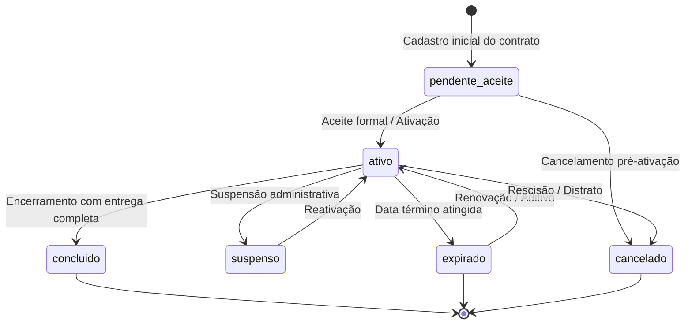
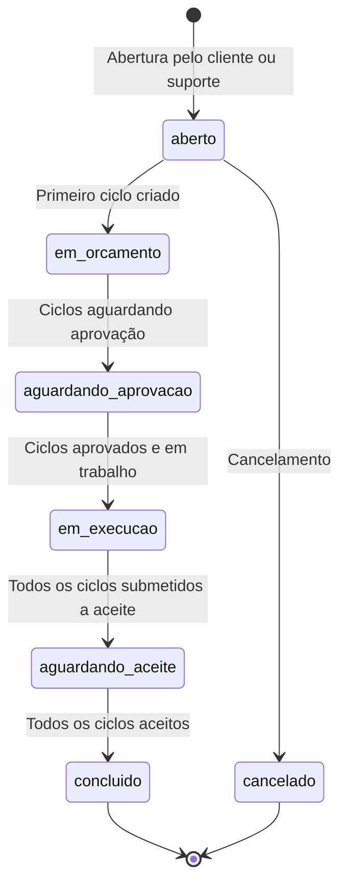
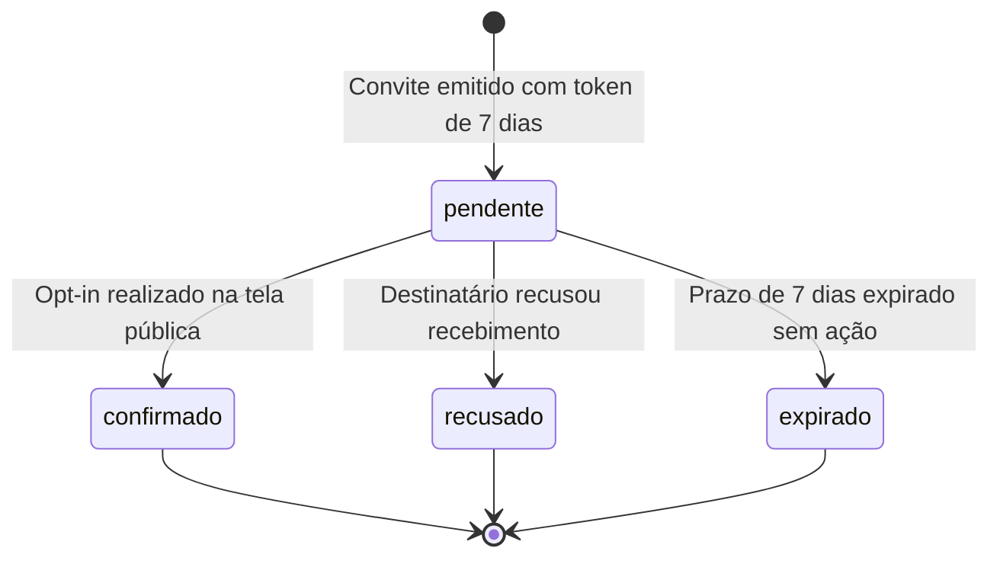

# Máquinas de Estado do Sistema — SHM 2.5.0

> Gerado pelo **Reversa Detective** em 2026-09-05  
> Sistema: **SHM 2.5.0 (Support Hours Manager)**

---

## 1. Máquina de Estados: Ciclo Técnico (`shm_ciclo`)

---

## 2. Máquina de Estados: Contrato (`shm_contrato`)

---

## 3. Máquina de Estados: Pedido de Suporte (`shm_pedido`)

---

## 4. Máquina de Estados: Convite de E-mail de Notificação (`shm_contrato_email_notificacao`)

