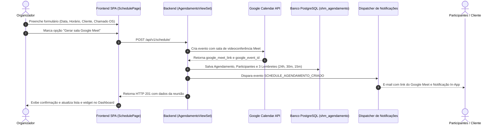

# User Story: Fluxo de Agendamento de Reuniões Técnicas e Integração Google Meet

> Módulo: `schedule` / `notificacoes` / `frontend`  
> Escala de Confiança: 🟢 CONFIRMADO (Implementado no SHM 2.5)

---

## 1. Visão Geral
Como técnico ou gerente da empresa prestadora ou como cliente contratante, quero agendar videoconferências de suporte técnico com sala Google Meet gerada automaticamente, para que possamos realizar alinhamentos de escopo, aprovações de orçamento ou homologações com pontualidade e registro formal.

## 2. Personas Envolvidas
- **Organizador (Técnico ou Gerente da Empresa):** Cria o compromisso, define pauta, associa cliente/chamado e convida participantes.
- **Cliente (Gerente ou Solicitante):** Recebe o convite, visualiza na agenda, acessa a sala virtual e recebe lembretes.
- **Participante Convidado:** Recebe e-mail com detalhes da reunião e botão de acesso direto ao Google Meet.

## 3. Fluxo Principal (Passo a Passo)

## 4. Regras e Validações
1. **Antecedência Obrigatória:** Data e hora de início devem ser estritamente no futuro.
2. **Isolamento de Dados:** Clientes só podem convidar e visualizar reuniões de sua própria empresa.
3. **Escalada de Lembretes:** Se a reunião for agendada com menos de 24h de antecedência, o lembrete de 24h é marcado como `IGNORADO` e os demais (30m e 15m) permanecem ativos.
4. **Proteção de Ruído:** O organizador não recebe notificação in-app no seu próprio sininho sobre a reunião que acabou de criar.
