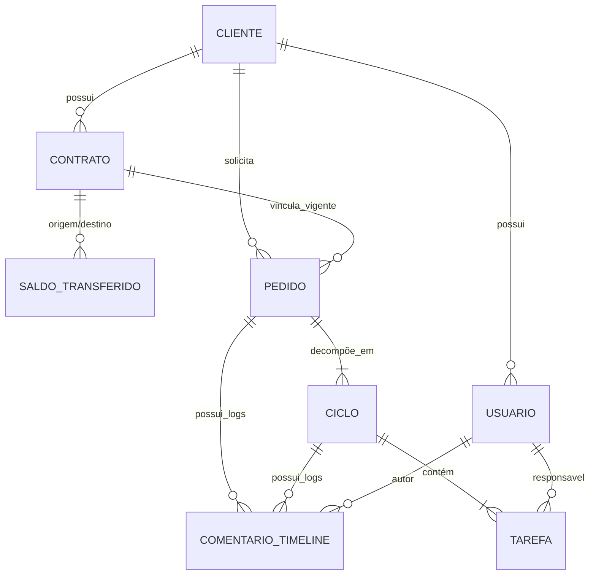

# 03 - Modelo de Entidades e Dados

Este documento descreve as entidades principais, seus relacionamentos, campos e regras estruturais no banco de dados PostgreSQL.

---

## 1. Entidades Detalhadas

### 1.1 `Cliente`
Representa a empresa contratante.
- `id` (UUID, PK)
- `razao_social` (VARCHAR 255)
- `nome_fantasia` (VARCHAR 255)
- `cnpj` (VARCHAR 18, UNIQUE)
- `email_contato` (VARCHAR 255)
- `telefone` (VARCHAR 30)
- `ativo` (BOOLEAN, default True)
- `created_at` (TIMESTAMP WITH TIME ZONE)
- `updated_at` (TIMESTAMP WITH TIME ZONE)

### 1.2 `Usuario` (Herda de AbstractBaseUser / PermissionsMixin)
Representa os operadores da Empresa e do Cliente.
- `id` (UUID, PK)
- `email` (VARCHAR 255, UNIQUE)
- `nome_completo` (VARCHAR 255)
- `telefone` (VARCHAR 30, opcional)
- `tipo_perfil` (ENUM: `ADMIN_EMPRESA`, `GESTOR_SUPORTE`, `TECNICO`, `GESTOR_CLIENTE`, `USUARIO_CLIENTE`)
- `cliente` (FK -> Cliente, NULL se for usuário da Empresa)
- `is_active` (BOOLEAN, default True)
- `created_at`, `updated_at`

### 1.3 `Contrato`
Controle de horas contratadas e saldo.
- `id` (UUID, PK)
- `numero_contrato` (VARCHAR 50, UNIQUE)
- `cliente` (FK -> Cliente, on_delete=PROTECT)
- `data_inicio` (DATE)
- `data_fim` (DATE)
- `horas_contratadas` (DECIMAL 10,2) — Ex: 100.00
- `horas_herdadas` (DECIMAL 10,2, default 0.00) — Saldo transferido (+ ou -)
- `horas_consumidas` (DECIMAL 10,2, default 0.00) — Calculado/agregado via transações
- `status` (ENUM: `RASCUNHO`, `ATIVO`, `VENCIDO`, `ENCERRADO`)
- `limite_rollover_dias` (INTEGER, default 30) — Janela para transferir saldo
- `prorrogacao_rollover_ate` (DATE, NULL) — Data manual definida pelo Admin
- `created_at`, `updated_at`

### 1.4 `SaldoTransferido` (Log de Rollover de Horas)
Registro auditável de transferências de saldo entre contratos.
- `id` (UUID, PK)
- `contrato_origem` (FK -> Contrato, related_name='transferencias_saida')
- `contrato_destino` (FK -> Contrato, related_name='transferencias_entrada')
- `horas_transferidas` (DECIMAL 10,2) — Pode ser positivo ou negativo
- `data_transferencia` (TIMESTAMP WITH TIME ZONE)
- `usuario_responsavel` (FK -> Usuario)
- `motivo` (TEXT)
- `created_at`

### 1.5 `Pedido` (Solicitação Geral)
Demanda inicial aberta pelo cliente ou criada pela empresa.
- `id` (UUID, PK)
- `codigo` (VARCHAR 30, UNIQUE) — Ex: `PED-2026-0001`
- `cliente` (FK -> Cliente)
- `contrato` (FK -> Contrato, contrato ativo no momento da abertura)
- `solicitante` (FK -> Usuario)
- `titulo` (VARCHAR 255)
- `descricao_geral` (TEXT)
- `status` (ENUM: `ABERTO`, `EM_ANALISE`, `AGUARDANDO_APROVACAO`, `EM_EXECUCAO`, `CONCLUIDO`, `ENCERRADO`, `CANCELADO`)
- `created_at`, `updated_at`

### 1.6 `Ciclo` (Unidade de Execução e Orçamento)
Contexto específico decomposto do pedido.
- `id` (UUID, PK)
- `pedido` (FK -> Pedido, on_delete=PROTECT, related_name='ciclos')
- `codigo` (VARCHAR 30) — Ex: `CIC-2026-0001-01`
- `titulo_contexto` (VARCHAR 255)
- `tipo_manutencao` (ENUM: `CORRETIVA`, `EVOLUTIVA`, `CONSULTORIA_TREINAMENTO`, `ANALISE_TECNICA`, `OUTROS`)
- `descricao_escopo` (TEXT)
- `horas_estimadas_total` (DECIMAL 10,2, default 0.00)
- `horas_realizadas_total` (DECIMAL 10,2, default 0.00)
- `status` (ENUM: `CRIADO`, `ORCADO`, `AGUARDANDO_APROVACAO`, `APROVADO`, `REJEITADO`, `EM_EXECUCAO`, `AGUARDANDO_ACEITE`, `ACEITO`, `ENCERRADO`)
- `aprovado_por` (FK -> Usuario, NULL)
- `aprovado_em` (TIMESTAMP WITH TIME ZONE, NULL)
- `aceite_por` (FK -> Usuario, NULL)
- `aceite_em` (TIMESTAMP WITH TIME ZONE, NULL)
- `motivo_rejeicao` (TEXT, NULL)
- `created_at`, `updated_at`

### 1.7 `Tarefa`
Trabalho técnico executado dentro do ciclo.
- `id` (UUID, PK)
- `ciclo` (FK -> Ciclo, on_delete=CASCADE, related_name='tarefas')
- `descricao` (TEXT)
- `responsavel_tecnico` (FK -> Usuario, NULL)
- `horas_estimadas` (DECIMAL 10,2, default 0.00)
- `horas_realizadas` (DECIMAL 10,2, default 0.00)
- `concluida` (BOOLEAN, default False)
- `created_at`, `updated_at`

### 1.8 `ComentarioTimeline`
Histórico temporal e registro de eventos.
- `id` (UUID, PK)
- `pedido` (FK -> Pedido, NULL)
- `ciclo` (FK -> Ciclo, NULL)
- `autor` (FK -> Usuario, NULL se gerado automaticamente pelo sistema)
- `tipo_evento` (ENUM: `COMENTARIO`, `MUDANCA_STATUS`, `AJUSTE_HORAS`, `APROVACAO`, `REJEICAO`, `ACEITE`, `SISTEMA`)
- `conteudo` (TEXT)
- `horas_contexto` (DECIMAL 10,2, NULL)
- `created_at` (TIMESTAMP WITH TIME ZONE)
