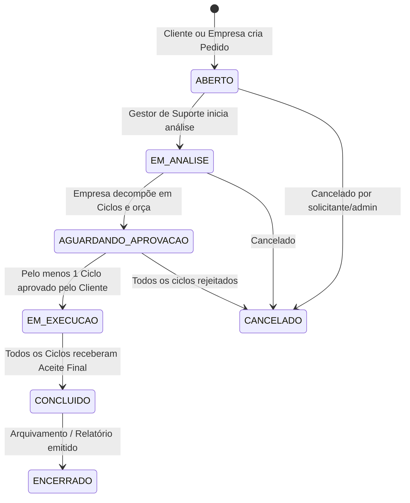
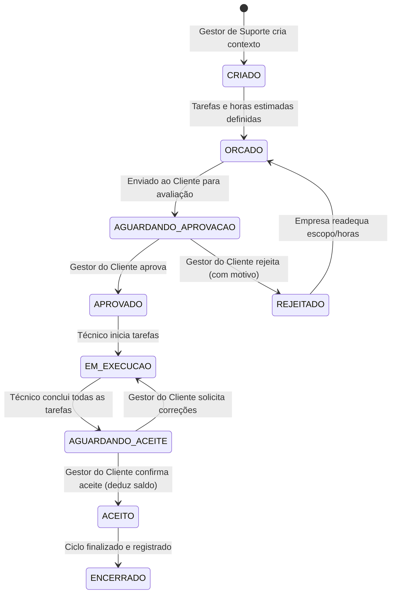
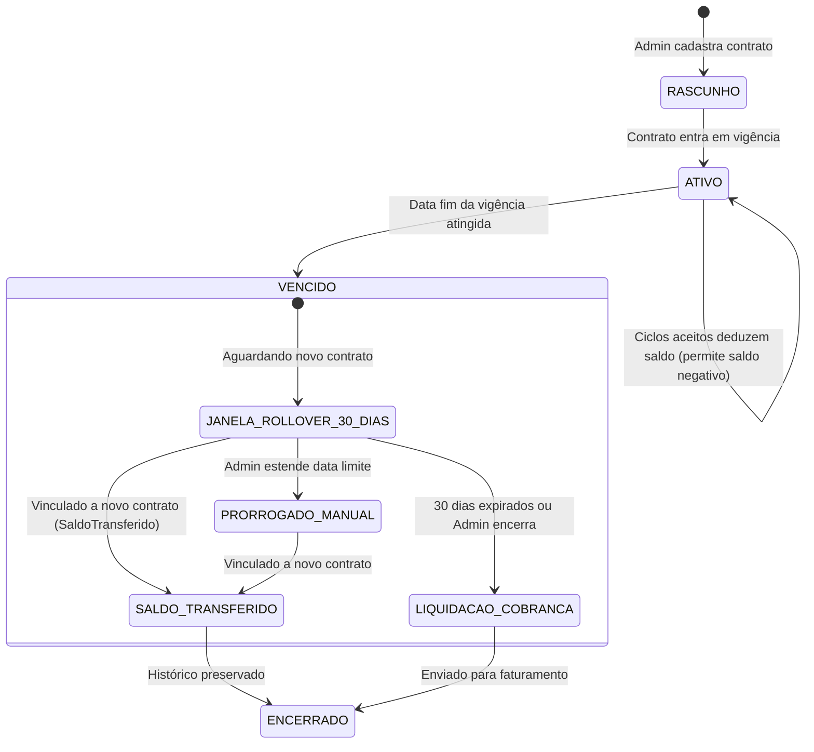

# 05 - Workflows e Máquinas de Estado

Este documento define os fluxos operacionais completos e as transições de estado para Pedidos, Ciclos e Contratos.

---

## 1. Workflow de Pedido (Solicitação)

---

## 2. Workflow do Ciclo de Execução

---

## 3. Workflow de Contrato, Rollover e Saldo Negativo

---

## 4. Matriz de Transições e Guardas de Estado

### Ciclo
| Estado Origem | Evento / Ação | Ator Autorizado | Condição / Guarda | Estado Destino |
| :--- | :--- | :--- | :--- | :--- |
| `CRIADO` | Concluir Estimativas | Gestor Suporte / Admin | Pelo menos 1 tarefa com horas estimadas > 0 | `ORCADO` |
| `ORCADO` | Enviar p/ Aprovação | Gestor Suporte / Admin | Nenhuma | `AGUARDANDO_APROVACAO` |
| `AGUARDANDO_APROVACAO` | Aprovar Orçamento | Gestor Cliente | Nenhuma | `APROVADO` |
| `AGUARDANDO_APROVACAO` | Rejeitar Orçamento | Gestor Cliente | Motivo de rejeição obrigatório | `REJEITADO` |
| `APROVADO` | Iniciar Execução | Técnico / Gestor Suporte | Nenhuma | `EM_EXECUCAO` |
| `EM_EXECUCAO` | Concluir Tarefas | Técnico / Gestor Suporte | Todas as tarefas com flag `concluida=True` e horas lançadas | `AGUARDANDO_ACEITE` |
| `AGUARDANDO_ACEITE` | Registrar Aceite Final | Gestor Cliente | Nenhuma (Dispara dedução de horas do Contrato) | `ACEITO` |
| `ACEITO` | Encerrar Ciclo | Sistema / Admin | Nenhuma | `ENCERRADO` |
