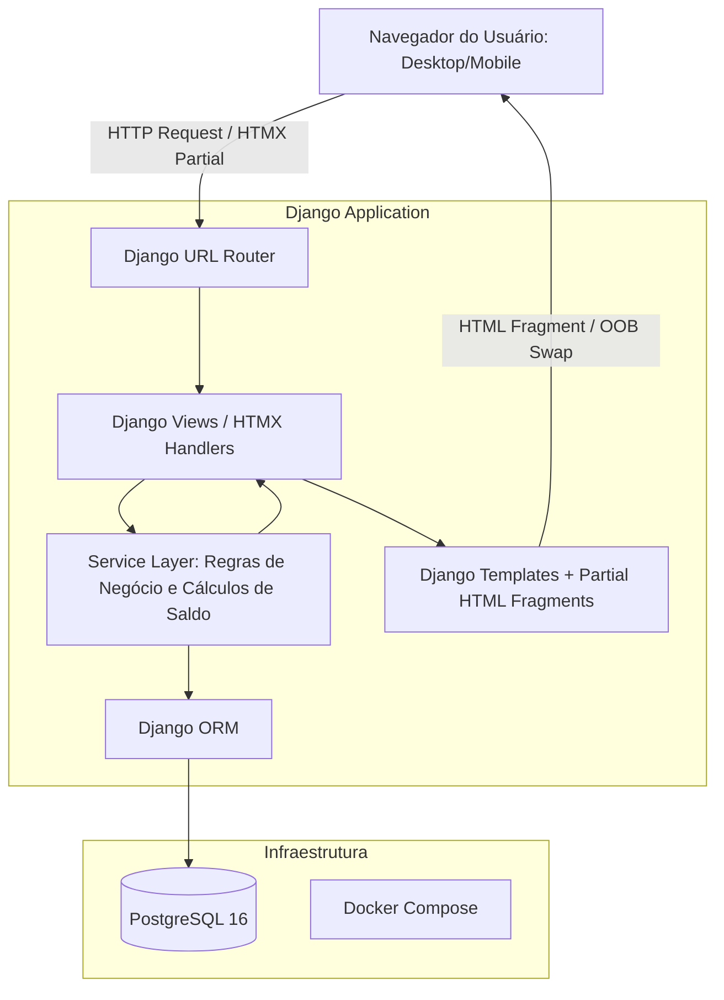

# 08 - Arquitetura Técnica e Infraestrutura

Este documento define a arquitetura técnica oficial do SHM utilizando a stack integrada **Django + HTMX + PostgreSQL**.

---

## 1. Visão Geral da Arquitetura

O SHM adota um padrão de **Monólito Modular Server-Driven**:
- **Backend**: Python 3.12+ com Django 5.x.
- **Camada de Interatividade**: HTMX 2.x + Alpine.js (para micro-interações de UI sem necessidade de SPA desacoplado).
- **Estilização**: Tailwind CSS (via CDN/Tailwind CLI integrado).
- **Banco de Dados**: PostgreSQL 16+ com conexões transacionais estritas (ACID) para manipulação de saldos e histórico.
- **Ambiente de Execução**: Docker e Docker Compose.



---

## 2. Estrutura do Projeto Backend

```
projeto-SHM/
├── backend/
│   ├── manage.py
│   ├── config/
│   │   ├── settings/
│   │   │   ├── base.py
│   │   │   ├── local.py
│   │   │   └── production.py
│   │   ├── urls.py
│   │   └── wsgi.py
│   └── shm/
│       ├── models/
│       │   ├── __init__.py
│       │   ├── clients.py        # Cliente
│       │   ├── users.py          # Usuario Customizado
│       │   ├── contracts.py      # Contrato, SaldoTransferido
│       │   ├── requests.py       # Pedido, Ciclo, Tarefa
│       │   └── timeline.py       # ComentarioTimeline
│       ├── services/             # REGRAS DE NEGÓCIO PURAS
│       │   ├── __init__.py
│       │   ├── contract_service.py # Cálculo de saldos, rollover, deduções
│       │   ├── workflow_service.py # Máquina de estados de pedidos e ciclos
│       │   └── timeline_service.py # Inserção e auditoria de logs
│       ├── views/                # HTMX Controllers (Views Finas)
│       │   ├── auth_views.py
│       │   ├── client_views.py
│       │   ├── contract_views.py
│       │   ├── request_views.py
│       │   ├── cycle_views.py
│       │   └── dashboard_views.py
│       ├── forms/                # Django Forms / Validações
│       ├── templates/
│       │   ├── base.html
│       │   ├── components/       # Modais, Badges, Timeline, Cards
│       │   ├── dashboards/
│       │   ├── contracts/
│       │   ├── requests/
│       │   └── cycles/
│       │       ├── partials/     # Fragmentos HTMX (linhas de tarefas, status)
│       └── tests/
│           ├── test_services/    # Testes unitários do cálculo de saldo e rollover
│           ├── test_workflows/   # Testes de transição de status e permissões
│           └── test_views/       # Testes de integração de templates/HTMX
├── docker-compose.yml
├── Dockerfile
├── requirements.txt
└── pyproject.toml
```

---

## 3. Padrões de Interação HTMX

1. **Atualizações Reativas de Saldo**:
   - Ao aceitar um ciclo ou apontar horas, o endpoint retorna o fragmento HTML do ciclo atualizado e dispara um swap fora de banda (`hx-swap-oob="true"`) para o card de resumo de saldo no cabeçalho do dashboard.
2. **Timeline Dinâmica**:
   - Comentários e logs adicionados inserem novos itens na timeline via `hx-swap="afterbegin"` sem recarregar a página inteira.
3. **Modais e Formulários Inline**:
   - Abertura de ciclos, edição de tarefas e apontamento de horas abrem em modais ou formulários inline gerenciados com HTMX.

---

## 4. Docker Compose Base

```yaml
version: '3.8'

services:
  db:
    image: postgres:16-alpine
    environment:
      POSTGRES_DB: shm_db
      POSTGRES_USER: shm_user
      POSTGRES_PASSWORD: shm_password
    volumes:
      - postgres_data:/var/lib/postgresql/data
    ports:
      - "5432:5432"

  backend:
    build: .
    command: python manage.py runserver 0.0.0.0:8000
    volumes:
      - ./backend:/app
    ports:
      - "8000:8000"
    environment:
      - DATABASE_URL=postgres://shm_user:shm_password@db:5432/shm_db
      - DEBUG=True
    depends_on:
      - db

volumes:
  postgres_data:
```
