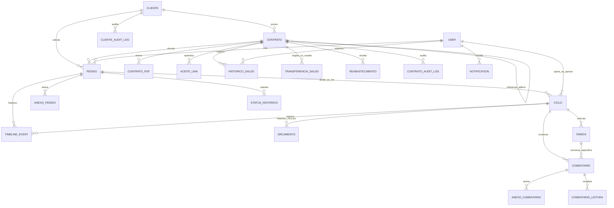

# 02. Arquitetura e Modelagem de Dados — SHM

Este documento detalha a estrutura de banco de dados, o diagrama de entidade-relacionamento (ERD), os esquemas de tabelas, tipos de dados, restrições de integridade e enumerações essenciais para o novo projeto.

---

## 1. Diagrama de Entidade-Relacionamento (ERD)

---

## 2. Dicionário de Tabelas e Modelagem Canônica

### 2.1 Tabela `cliente` (`shm_cliente`)
Armazena a entidade jurídica ou física tomadora dos serviços.

| Campo | Tipo | Nulo | Default | Descrição / Regras |
|---|---|---|---|---|
| `id` | BigInt (PK) | Não | Auto | Identificador primário |
| `tipo` | Varchar(2) | Não | - | `PF` (Pessoa Física) ou `PJ` (Pessoa Jurídica) |
| `razao_social` | Varchar(200) | Sim | NULL | Obrigatório se `tipo == PJ` |
| `nome_fantasia` | Varchar(200) | Sim | NULL | Nome comercial |
| `cnpj` | Varchar(14) | Sim | NULL | 14 dígitos (apenas números). Único para PJ ativo |
| `nome_completo` | Varchar(200) | Sim | NULL | Obrigatório se `tipo == PF` |
| `cpf` | Varchar(11) | Sim | NULL | 11 dígitos (apenas números). Único para PF ativo |
| `rg` | Varchar(20) | Sim | NULL | Registro Geral |
| `data_nascimento`| Date | Sim | NULL | Data de nascimento (PF) |
| `email_contato` | Varchar(254) | Não | - | E-mail principal de notificações e cobrança |
| `telefone` | Varchar(20) | Sim | NULL | Telefone / WhatsApp de contato |
| `pessoa_contato`| Varchar(150) | Sim | NULL | Nome do responsável operacional |
| `cep` | Varchar(8) | Sim | NULL | CEP (8 dígitos numéricos) |
| `logradouro` | Varchar(200) | Sim | NULL | Rua, Avenida, etc. |
| `numero` | Varchar(20) | Sim | NULL | Número do endereço |
| `complemento` | Varchar(100) | Sim | NULL | Sala, bloco, etc. |
| `bairro` | Varchar(100) | Sim | NULL | Bairro |
| `cidade` | Varchar(100) | Sim | NULL | Município |
| `estado` | Varchar(2) | Sim | NULL | UF (ex.: SP, RJ, PR) |
| `status` | Varchar(10) | Não | `'ativo'` | `ativo`, `inativo` |
| `criado_em` | DateTime | Não | NOW() | Timestamp de criação |
| `atualizado_em` | DateTime | Não | NOW() | Timestamp de modificação |

**Constraints & Índices:**
- `chk_cliente_tipo`: `tipo IN ('PF', 'PJ')`
- `chk_cliente_status`: `status IN ('ativo', 'inativo')`
- `uq_cliente_cpf`: Unique em `cpf` quando `tipo = 'PF'`
- `uq_cliente_cnpj`: Unique em `cnpj` quando `tipo = 'PJ'`

---

### 2.2 Tabela `contrato` (`shm_contrato`)
Gerencia o pacote de horas contratadas e o saldo disponível.

| Campo | Tipo | Nulo | Default | Descrição / Regras |
|---|---|---|---|---|
| `id` | BigInt (PK) | Não | Auto | Identificador primário |
| `numero` | Varchar(30) | Não | - | Código formatado: `CT-YYYY-NNNN` (Único) |
| `tipo` | Varchar(10) | Não | `'novo'` | `novo`, `aditivo` |
| `contrato_referencia_id` | BigInt (FK) | Sim | NULL | FK para `contrato.id` (Obrigatório se tipo `aditivo`) |
| `cliente_id` | BigInt (FK) | Não | - | FK para `cliente.id` (ON DELETE PROTECT) |
| `data_inicio` | Date | Não | - | Início da vigência |
| `data_termino` | Date | Sim | NULL | Fim da vigência (se NULL, indeterminado) |
| `horas_contratadas` | Decimal(10,2) | Não | - | Total de horas acordadas (> 0) |
| `saldo` | Decimal(10,2) | Não | `0.00` | Saldo calculado atual de horas |
| `horas_consumidas` | Decimal(10,2) | Não | `0.00` | Total de horas acumuladas em ciclos aceitos |
| `data_fim_carencia` | Date | Sim | NULL | `data_termino + 30 dias` quando expirado |
| `descricao_servicos` | Text | Sim | NULL | Escopo dos serviços de suporte |
| `valor_mensal` | Decimal(12,2) | Sim | NULL | Valor financeiro mensal (opcional) |
| `observacoes` | Text | Sim | NULL | Notas internas |
| `status` | Varchar(20) | Não | `'pendente_aceite'` | `pendente_aceite`, `ativo`, `suspenso`, `expirado` |
| `data_aceite` | DateTime | Sim | NULL | Data em que o cliente aceitou o contrato |
| `criado_por_id` | BigInt (FK) | Não | - | FK para `User` (Gestor da Empresa) |
| `criado_em` | DateTime | Não | NOW() | Timestamp de criação |
| `atualizado_em` | DateTime | Não | NOW() | Timestamp de modificação |

**Propriedades de Domínio e Fórmulas:**
- `em_carencia`: `data_fim_carencia >= HOJE`
- `saldo_devedor`: `ABS(saldo)` se `saldo < 0`, senão `0.00`
- `saldo_remanescente`: `saldo` se `saldo > 0 AND status == 'expirado' AND em_carencia`, senão `0.00`

---

### 2.3 Tabela `pedido` (`shm_pedido`)
Agrupador macro da solicitação do cliente.

| Campo | Tipo | Nulo | Default | Descrição / Regras |
|---|---|---|---|---|
| `id` | BigInt (PK) | Não | Auto | Identificador primário |
| `protocolo` | Varchar(20) | Não | - | Padrão: `OSYYYYMMNNNN` (ex.: `OS2026080001`, Único) |
| `cliente_id` | BigInt (FK) | Não | - | FK para `cliente.id` |
| `contrato_id` | BigInt (FK) | Não | - | FK para `contrato.id` (Deve estar Ativo) |
| `assunto` | Varchar(200) | Não | - | Título resumido da solicitação |
| `descricao` | Text | Não | - | Detalhamento livre da demanda |
| `prioridade` | Varchar(10) | Não | `'media'` | `baixa`, `media`, `alta`, `urgente` |
| `status` | Varchar(25) | Não | `'aberto'` | `aberto`, `em_orcamento`, `aguardando_aprovacao`, `em_execucao`, `aguardando_aceite`, `concluido`, `cancelado` |
| `criado_por_id` | BigInt (FK) | Não | - | FK para `User` (Cliente ou Operador) |
| `criado_em` | DateTime | Não | NOW() | Data/hora de abertura |
| `atualizado_em` | DateTime | Não | NOW() | Data/hora de alteração |

---

### 2.4 Tabela `ciclo` (`shm_ciclo`)
Unidade autônoma de orçamento, execução, tarefas e aceite de horas.

| Campo | Tipo | Nulo | Default | Descrição / Regras |
|---|---|---|---|---|
| `id` | BigInt (PK) | Não | Auto | Identificador primário |
| `pedido_id` | BigInt (FK) | Não | - | FK para `pedido.id` (ON DELETE CASCADE) |
| `tipo` | Varchar(20) | Não | `'analise'` | `corretiva`, `evolutiva`, `preventiva`, `analise`, `consultoria`, `treinamento` |
| `contexto` | Text | Sim | NULL | Explicação técnica do recorte de trabalho |
| `operador_id` | BigInt (FK) | Não | - | FK para `User` (Técnico responsável) |
| `status` | Varchar(25) | Não | `'orcado'` | `orcado`, `aguardando_aprovacao`, `aprovado`, `em_execucao`, `aguardando_aceite`, `aceito`, `cancelado` |
| `horas_estimadas` | Decimal(8,2) | Não | `0.00` | Horas orçadas para aprovação |
| `horas_realizadas` | Decimal(8,2) | Não | `0.00` | Soma das horas reais das tarefas concluídas |
| `inicio` | DateTime | Não | NOW() | Criação do ciclo |
| `fim` | DateTime | Sim | NULL | Conclusão/Aceite do ciclo |
| `apresentado_em` | DateTime | Sim | NULL | Data de envio do orçamento |
| `aprovado_em` | DateTime | Sim | NULL | Data de aprovação pelo cliente |
| `aprovado_por_id`| BigInt (FK) | Sim | NULL | FK para `User` (Gerente do Cliente) |
| `aceito_em` | DateTime | Sim | NULL | Data de aceite final do cliente |
| `aceito_por_id` | BigInt (FK) | Sim | NULL | FK para `User` (Gerente do Cliente) |
| `token_acesso` | UUID | Não | uuid4 | Token único para Magic Link |

---

### 2.5 Tabela `tarefa` (`shm_tarefa`)
Apontamentos técnicos de esforço dentro do ciclo.

| Campo | Tipo | Nulo | Default | Descrição / Regras |
|---|---|---|---|---|
| `id` | BigInt (PK) | Não | Auto | Identificador primário |
| `ciclo_id` | BigInt (FK) | Não | - | FK para `ciclo.id` (ON DELETE CASCADE) |
| `descricao` | Text | Não | - | Descrição do item técnico de trabalho |
| `horas_estimadas` | Decimal(8,2) | Não | `0.00` | Horas estimadas no orçamento |
| `horas_realizadas`| Decimal(8,2) | Não | `0.00` | Horas efetivamente gastas |
| `status` | Varchar(15) | Não | `'prevista'`| `prevista`, `realizada`, `cancelada` |
| `operador_id` | BigInt (FK) | Sim | NULL | FK para `User` (Quem executou) |
| `criado_em` | DateTime | Não | NOW() | Data de cadastro |
| `atualizado_em` | DateTime | Não | NOW() | Data de alteração |

---

### 2.6 Tabelas de Gestão Financeira de Saldo

#### Tabela `historico_saldo` (`shm_historico_saldo`) — Ledger Imutável
| Campo | Tipo | Nulo | Descrição |
|---|---|---|---|
| `id` | UUID (PK) | Não | UUID v4 |
| `contrato_id` | BigInt (FK) | Não | FK para `contrato.id` |
| `tipo_operacao` | Varchar(30) | Não | `consumo`, `transferencia_envio`, `transferencia_recebimento`, `reabastecimento`, `estorno` |
| `quantidade` | Decimal(8,2) | Não | Valor com sinal (ex.: -10.00 ou +20.00) |
| `saldo_resultante` | Decimal(10,2)| Não | Saldo consolidado após a operação |
| `autor_id` | BigInt (FK) | Sim | FK para `User` |
| `descricao` | Text | Sim | Motivo / Detalhes |
| `pedido_id` | BigInt (FK) | Sim | FK para `pedido.id` (em caso de consumo) |
| `operacao_original_id` | UUID | Sim | Referência em caso de estorno |
| `criado_em` | DateTime | Não | Timestamp imutável |

#### Tabela `transferencia_saldo` (`shm_transferencia_saldo`)
Registra transferências entre contratos do mesmo cliente (`contrato_origem_id`, `contrato_destino_id`, `quantidade`, `motivo`, `autor_id`, `criado_em`).

#### Tabela `reabastecimento` (`shm_reabastecimento`)
Registra créditos avulsos de horas (`contrato_id`, `quantidade`, `motivo`, `autor_id`, `criado_em`).

---

### 2.7 Tabelas de Colaboração e Notificações

#### Tabela `comentario` (`shm_comentario`)
- `id` (UUID PK), `ciclo_id` (FK Ciclo), `tarefa_id` (FK Tarefa nullable), `autor_id` (FK User), `texto` (Text max 4000), `tarefa_convertida_id` (FK Tarefa nullable), `criado_em`.

#### Tabela `anexo_comentario` & `anexo_pedido`
- Upload seguro com validação de extensão, tamanho máximo (10MB) e armazenamento estruturado por ano/mês (`contratos/%Y/%m/`, `pedidos/%Y/%m/`, `comentarios/%Y/%m/`).

#### Tabela `timeline_event` (`shm_timeline_event`)
- Registro de auditoria transparente: `pedido_id`, `ciclo_id`, `tipo` (Enum `TipoEventoTimeline`), `descricao`, `autor_id`, `metadados` (JSONB), `timestamp`.