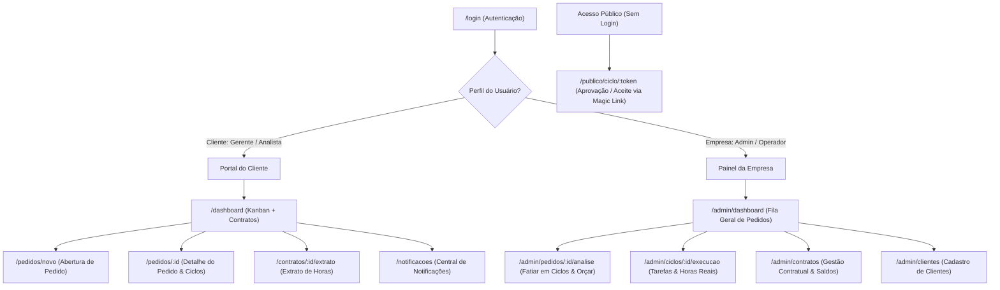

# 04. Especificações de Telas e Experiência do Usuário (UI/UX)

Este documento descreve detalhadamente o mapa de navegação, layout das interfaces, comportamentos interativos, estados visuais e diretrizes de experiência do usuário (UX) para o novo projeto SHM.

---

## 1. Mapa Geral de Navegação e Rotas



---

## 2. Portal do Cliente — Telas e Interações

### 2.1 Tela 1: Dashboard do Cliente (Kanban em 3 Zonas)
A tela inicial do cliente foi desenhada para dar visibilidade imediata sobre o saldo e o andamento das solicitações.

```
┌────────────────────────────────────────────────────────────────────────────────────────┐
│  [SHM Logo]        [Filtro: Todos os Contratos ▼]       🔔(3)    👤 João Silva [Sair]  │
├─────────────────┬──────────────────────────────────────────────────────────────────────┤
│ MEUS CONTRATOS  │ PAINEL DE PEDIDOS                            [ + Abrir Novo Pedido ] │
│                 │                                                                      │
│ ┌─────────────┐ │ ┌──────────┬──────────┬──────────┬──────────┬──────────┬───────────┐ │
│ │ CT-2026-001 │ │ │ ABERTOS  │ EM ORÇ.  │ AG. APROV│ EM EXEC. │ AG. ACEIT│ CONCLUÍDOS│ │
│ │ Saldo: 45h  │ │ ├──────────┼──────────┼──────────┼──────────┼──────────┼───────────┤ │
│ │ Vigência:   │ │ │ OS202601 │ OS202603 │ OS202604 │ OS202602 │ OS202605 │ OS202600  │ │
│ │ 31/12/2026  │ │ │ Bugs no  │ Ajuste de│ Relatório│ Integração│ Módulo de│ Importação│ │
│ └─────────────┘ │ │ login    │ impostos │ gerencial│ ERP      │ NF-e     │ de dados  │ │
│ ┌─────────────┐ │ │ 🔴 Alta  │ 🟡 Média │ 🟡 Média │ 🔴 Alta  │ 🟢 Baixa │ ⚪ 14h    │ │
│ │ CT-2026-002 │ │ └──────────┴──────────┴──────────┴──────────┴──────────┴───────────┘ │
│ │ Saldo: 12h  │ │                                                                      │
│ └─────────────┘ │                                                                      │
└─────────────────┴──────────────────────────────────────────────────────────────────────┘
```

- **Zona 1 (Header Superior)**: Identidade visual, dropdown seletor de contrato ativo (filtra todo o painel), badge interativo de notificações não lidas e menu de usuário.
- **Zona 2 (Sidebar Esquerda - Resumo de Contratos)**: Cards compactos de cada contrato ativo do cliente exibindo: número, horas contratadas, saldo atual, consumo acumulado e data de término de vigência. Clique em um contrato filtra o Kanban; clique no card expande o extrato.
- **Zona 3 (Área Central - Kanban de 6 Colunas)**:
  1. `Abertos` (Aguardando triagem da empresa)
  2. `Em Orçamento` (Empresa decompondo em ciclos e estimando horas)
  3. `Aguardando Aprovação` (Ciclos com orçamento pronto aguardando aceite comercial do cliente)
  4. `Em Execução` (Técnicos executando tarefas ativas)
  5. `Aguardando Aceite` (Serviço finalizado, aguardando aceite técnico/negócio do cliente)
  6. `Concluídos` (Todos os ciclos aceitos e horas debitadas)

---

### 2.2 Tela 2: Detalhe do Pedido com Carrossel de Ciclos
Ao clicar em um card do Kanban, o usuário é direcionado para a tela de gestão do pedido.

```
← Voltar ao Painel                                           Pedido #OS2026080001
─────────────────────────────────────────────────────────────────────────────────
Dados do Pedido: "Correção de lentidão e treinamento da equipe fiscal"
Contrato: CT-2026-001 (Saldo: 45.00h) | Aberto em: 20/08/2026 por Carlos Lima | Prioridade: 🔴 Alta
─────────────────────────────────────────────────────────────────────────────────
CICLOS DE ATENDIMENTO DESTE PEDIDO (2 Ciclos)

 ┌────────────────────────────────────────┐  ┌────────────────────────────────────────┐
 │ [ ◀ ]  Ciclo 1/2 — CORRETIVA   [ ▶ ]   │  │ [ ◀ ]  Ciclo 2/2 — TREINAMENTO [ ▶ ]   │
 │ "Otimização de consultas do banco"     │  │ "Treinamento módulo SPED Fiscal"       │
 │                                        │  │                                        │
 │ Status: 🟡 Aguardando Aprovação         │  │ Status: 🟢 Em Execução                 │
 │ Orçamento Estimado: 8.00h              │  │ Orçamento Aprovado: 4.00h              │
 │ Responsável: Marcos Técnico            │  │ Responsável: Amanda Especialista       │
 │ Tarefas Previstas:                     │  │ Tarefas Realizadas:                    │
 │  • Análise de índices (2.0h)           │  │  • Gravação de aula (2.0h) - Concluída │
 │  • Refatoração query (6.0h)            │  │  • Plantão de dúvidas (2.0h) - Em and. │
 │                                        │  │                                        │
 │ [ ✅ Aprovar Orçamento ] [ ❌ Rejeitar ] │  │ [ 💬 Adicionar Comentário ]            │
 └────────────────────────────────────────┘  └────────────────────────────────────────┘

─────────────────────────────────────────────────────────────────────────────────
TIMELINE & COMENTÁRIOS DO CICLO SELECIONADO
[21/08 14:00] Marcos Técnico: "Orçamento emitido com estimativa de 8h."
[21/08 14:30] Carlos Lima (Cliente): "Favor priorizar a tabela de notas fiscais."
[ Campo de Digitação de Novo Comentário... ] [ 📎 Anexar Arquivo ] [ Enviar ]
```

- **Ações Contextuais do Cliente**:
  - Se o ciclo estiver em `Aguardando Aprovação`: Botão **Aprovar Orçamento** (abre modal com confirmação de débito futuro) ou **Rejeitar Orçamento** (abre modal com campo obrigatório de justificativa).
  - Se o ciclo estiver em `Aguardando Aceite`: Botão **Aceitar e Encerrar** (confirmação que debita as `horas_realizadas` do contrato) ou **Recusar Aceite** (com justificativa de pendência técnica).
  - Em qualquer momento: Área de comentários temporais com suporte a envio de arquivos anexos.

---

### 2.3 Tela 3: Novo Pedido de Suporte
Formulário simples e objetivo:
- **Contrato Vinculado**: Select com os contratos ativos do cliente (com exibição do saldo disponível ao lado).
- **Assunto**: Linha de texto descritiva e concisa.
- **Descrição**: Textarea rico para detalhamento do problema ou necessidade.
- **Nível de Prioridade**: Radio buttons / Chips visuais (`Baixa`, `Média`, `Alta`, `Urgente`).
- **Zona de Upload de Arquivos**: Drag-and-drop para múltiplos anexos (screenshots, relatórios, planilhas) de até 10MB cada.

---

### 2.4 Tela 4: Extrato e Relatório Detalhado do Contrato
Visão contábil e de transparência do contrato:
- **Painel Superior**: Total de horas contratadas, saldo atual disponível, consumo acumulado, barra de progresso visual de vigência e indicador de dias restantes para o término.
- **Seção de Anexos do Contrato**: Lista de PDFs oficiais disponíveis para download (Contrato mãe, Termos de Aditivo, Proposta Comercial).
- **Histórico de Consumo por Ciclo**: Tabela contendo data de aceite, protocolo do pedido, tipo e nome do ciclo, técnico executor e quantidade de horas reais debitadas.
- **Projeção para Renovação**: Cálculo automático de saldo remanescente disponível para migração em caso de renovação dentro do período de carência.

---

## 3. Painel do Prestador (Empresa) — Telas Operacionais

### 3.1 Tela de Análise e Triagem de Pedido (`/admin/pedidos/:id/analise`)
- Visualização dos dados originais enviados pelo cliente.
- Ferramenta para **Dividir em Ciclos**:
  - Botão `+ Adicionar Ciclo Contextual`.
  - Seleção do Tipo de Ciclo (`Corretiva`, `Evolutiva`, `Preventiva`, `Análise`, `Consultoria`, `Treinamento`).
  - Definição do contexto técnico e atribuição do Operador/Técnico responsável.
  - Listagem de **Tarefas Previstas** com horas estimadas para compor o orçamento.
  - Botão de envio do orçamento: `Apresentar Orçamento ao Cliente` (dispara e-mail com Magic Link e altera status para `Aguardando Aprovação`).

### 3.2 Tela de Execução e Apontamento de Horas (`/admin/ciclos/:id/execucao`)
- Tela de trabalho do técnico responsável pelo ciclo:
  - Lista de tarefas ativas do ciclo.
  - Adição de novas tarefas reais ou edição de tarefas previstas.
  - Apontamento de `horas_realizadas` por tarefa.
  - Registro de comentários técnicos e conversão de dúvidas do cliente em novas tarefas.
  - Botão `Solicitar Aceite do Cliente`: Finaliza a execução técnica e notifica o cliente para aprovação final.

---

## 4. Telas Públicas — Magic Links (Sem Login)

### 4.1 Aprovação / Aceite via Link Mágico (`/publico/ciclo/:token`)
- Layout limpo, responsivo e seguro, focado em dispositivos móveis e desktop:
  - Cabeçalho com identificação do Cliente, Pedido e Contrato.
  - Card de Resumo: Tipo de Ciclo, Horas Estimadas/Realizadas, Descrição dos Serviços e Lista de Tarefas executadas.
  - Botões de Ação Direta em destaque:
    - **Aprovar Orçamento** / **Aceitar Conclusão** (com clique único e confirmação).
    - **Rejeitar** / **Recusar** (com caixa de texto expansível para justificar a recusa).
  - Feedback imediato de confirmação com recibo eletrônico na tela.