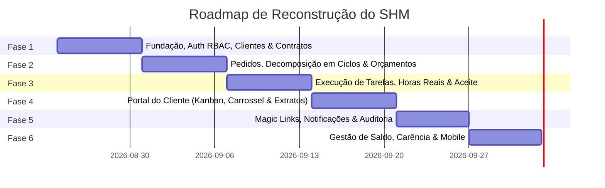

# 05. Plano de Reconstrução e Roadmap — SHM na Raiz

Este documento estabelece o plano técnico completo, a stack tecnológica moderna recomendada, a estrutura de diretórios e o roadmap faseado para reconstruir a aplicação a partir da raiz do repositório (`C:/Users/andre/mkt-dnb/dev/Antigravity/projeto-SHM`).

---

## 1. Stack Tecnológica Recomendada

Para garantir robustez, desempenho, facilidade de manutenção e excelente experiência de desenvolvimento:

### 1.1 Backend
- **Linguagem / Framework**: Python 3.12+ com Django 5.x + Django REST Framework.
- **Banco de Dados**: PostgreSQL 16+ (com constraints, foreign keys e índices nativos).
- **Documentação de API**: `drf-spectacular` (Geração automática de OpenAPI 3.0 / Swagger UI).
- **Autenticação**: JWT com `djangorestframework-simplejwt` + RBAC customizado com perfis explícitos (`EMPRESA_ADMIN`, `EMPRESA_TECNICO`, `CLIENTE_GERENTE`, `CLIENTE_ANALISTA`).
- **Validação de Documentos**: `validate-docbr` para CPF e CNPJ.
- **Fila Assíncrona / Tarefas**: Celery + Redis (para envio de e-mails, expiração de prazos e cálculo de carência).
- **Testes**: `pytest-django`, `factory-boy`, `pytest-cov`.

### 1.2 Frontend
- **Framework**: React 19 + TypeScript + Vite.
- **Design System & Estilos**: Tailwind CSS v4 + Shadcn UI (Radix UI) + Lucide Icons.
- **Gerenciamento de Estado de Servidor / Cache**: TanStack Query v5 (React Query) para evitar *race conditions*, chamadas redundantes e gerenciar cache de forma transparente.
- **Roteamento**: React Router v7 com rotas protegidas por perfil (RBAC).
- **Formulários & Validação**: React Hook Form + Zod.
- **Componentes Avançados**: `@hello-pangea/dnd` ou similar para o Kanban arrastável e carrossel de ciclos fluido.
- **Cliente HTTP**: Axios com interceptors robustos para renovação transparente de tokens JWT e tratamento centralizado de erros.

---

## 2. Estrutura de Diretórios Proposta para a Raiz

A raiz do repositório será organizada com total separação de responsabilidades:

```
projeto-SHM/
├── backend/                       # Aplicação Django REST API
│   ├── config/                    # Configurações do projeto (settings, urls, asgi, wsgi)
│   ├── apps/
│   │   ├── core/                  # Utilitários, permissões base, modelos abstratos
│   │   ├── accounts/              # Usuários customizados, RBAC, autenticação JWT
│   │   ├── clientes/              # Gestão de Clientes PF/PJ e endereços
│   │   ├── contratos/             # Contratos, aditivos, PDFs, carência e links de aceite
│   │   ├── pedidos/               # Pedidos, protocolos e sincronização de status
│   │   ├── ciclos/                # Ciclos contextuais, orçamentos, aprovações e aceites
│   │   ├── tarefas/               # Tarefas operacionais e apontamento de horas reais
│   │   ├── saldo/                 # Ledger financeiro, transferências, reabastecimento e estorno
│   │   ├── comunicacao/           # Comentários temporais, anexos e conversão em tarefas
│   │   └── notificacoes/          # Infraestrutura de notificações in-app e e-mails
│   ├── manage.py
│   ├── requirements.txt
│   ├── pyproject.toml
│   └── Dockerfile
├── frontend/                      # Aplicação React SPA
│   ├── src/
│   │   ├── api/                   # Cliente Axios configurado e serviços de API tipados
│   │   ├── components/            # Componentes Shadcn UI e componentes reutilizáveis
│   │   │   ├── ui/                # Botões, modais, inputs, badges, cards, tabelas
│   │   │   ├── kanban/            # Colunas e cards do Kanban do cliente e operador
│   │   │   ├── ciclo-carousel/    # Carrossel interativo de ciclos e aprovações
│   │   │   └── layout/            # Headers, sidebars e containers de layout
│   │   ├── contexts/              # Contexto de autenticação e notificações
│   │   ├── hooks/                 # Custom hooks com TanStack Query
│   │   ├── pages/                 # Páginas do Portal do Cliente, Painel da Empresa e Públicas
│   │   ├── types/                 # Interfaces e Enums TypeScript canônicos
│   │   └── App.tsx                # Roteador com guards de autenticação
│   ├── package.json
│   ├── vite.config.ts
│   └── tailwind.config.js
├── relatorio-legado/              # Dossiê de análise e regras do legado (preservado)
├── docker-compose.yml             # Orquestração local (Postgres + Redis + Backend + Frontend)
├── .gitignore                     # Gitignore limpo e sem artefatos temporários
└── README.md                      # Documentação de inicialização do projeto
```

---

## 3. Roadmap de Implementação Faseado



### Fase 1: Fundação, Autenticação RBAC e Cadastros Base
- [ ] Configuração do repositório limpo, Docker Compose (PostgreSQL 16 + Redis), `.gitignore` rigoroso.
- [ ] Implementação do modelo `User` customizado com enums de perfil (`EMPRESA_ADMIN`, `EMPRESA_TECNICO`, `CLIENTE_GERENTE`, `CLIENTE_ANALISTA`) e autenticação JWT (login, refresh, me).
- [ ] Módulo de **Clientes** (PF/PJ com validações de CPF/CNPJ via `validate-docbr`).
- [ ] Módulo de **Contratos** (número sequencial `CT-YYYY-NNNN`, vigência, horas contratadas, saldo, upload de até 3 PDFs, link de aceite eletrônico).
- [ ] Testes unitários com Pytest e Factories.

### Fase 2: Gestão de Pedidos, Decomposição em Ciclos e Orçamentos
- [ ] Módulo de **Pedidos** (geração automática do protocolo `OSYYYYMMNNNN`, vinculação obrigatória a contrato ativo).
- [ ] Módulo de **Ciclos de Atendimento** (tipos: Corretiva, Evolutiva, Preventiva, Análise, Consultoria, Treinamento).
- [ ] Emissão de **Orçamentos** por ciclo (horas estimadas, tarefas previstas e token de acesso).
- [ ] Fluxo de **Aprovação / Rejeição** de orçamento pelo cliente (com justificativa obrigatória em caso de recusa).
- [ ] Máquina de sincronização automática do status do Pedido com base no estado dos Ciclos.

### Fase 3: Execução de Tarefas, Apontamento de Horas Reais e Aceite
- [ ] Módulo de **Tarefas** vinculadas ao Ciclo (descrição, operador, horas estimadas vs horas realizadas).
- [ ] Interface de apontamento de horas técnicas e lançamento de esforço real executado.
- [ ] Fluxo de **Solicitação de Aceite** pelo operador técnico.
- [ ] **Fluxo de Aceite Final pelo Cliente**:
  - Aceite concede quitação do ciclo.
  - **Débito automático no saldo do contrato** baseado nas `horas_realizadas`.
  - Recusa de aceite com justificativa técnica retorna ciclo para execução.

### Fase 4: Frontend — Portal do Cliente & Painel da Empresa
- [ ] Configuração do frontend com Tailwind CSS + Shadcn UI + TanStack Query.
- [ ] **Dashboard do Cliente**: Layout de 3 zonas com Kanban de 6 colunas, sidebar de contratos e filtros dinâmicos.
- [ ] **Detalhe do Pedido**: Carrossel navegável de ciclos ordenado por prioridade de atenção, cards com botões contextuais e timeline de comentários.
- [ ] **Formulário de Novo Pedido** com drag-and-drop de múltiplos anexos.
- [ ] **Extrato do Contrato** com histórico de consumo de ciclos, download de PDFs e saldo remanescente.
- [ ] **Painel da Empresa**: Triagem de pedidos, criação de ciclos, painel de execução técnica e gestão de contratos.

### Fase 5: Magic Links, Central de Notificações e Timeline
- [ ] Criação das telas públicas de **Magic Link** (`/publico/ciclo/:token`) para aprovação e aceite instantâneos sem login.
- [ ] Infraestrutura de **Notificações**:
  - Central In-App (badge com contador no header, dropdown e página de listagem).
  - Envio assíncrono de e-mails com templates padronizados.
- [ ] Sistema de **Comentários Temporais** com anexos e conversão de comentário em tarefa técnica.
- [ ] Timeline de auditoria com histórico cronológico de todos os eventos relevantes.

### Fase 6: Gestão Avançada de Saldo, Carência e Polimento Final
- [ ] **Gestão Financeira de Saldo**:
  - Transferência de saldo entre contratos do mesmo cliente.
  - Reabastecimento manual de horas.
  - Estorno de operações compensatórias no ledger imutável.
- [ ] Rotina automática de **Carência de 30 dias** para contratos expirados e migração de saldo remanescente para renovações.
- [ ] Otimização de responsividade mobile (Kanban colapsável, carrossel touch-friendly).
- [ ] Script de seed (`python manage.py seed_demo_data`) com dados completos para demonstração imediata do fluxo de ponta a ponta.

---

## 4. Guia de Inicialização do Desenvolvimento

Assim que o usuário autorizar a reconstrução na raiz, os passos imediatos serão:
1. Limpar os arquivos residuais da raiz (`=10.0`, `=2.0`, etc.).
2. Inicializar a estrutura modular de backend e frontend descrita neste plano.
3. Executar as migrações iniciais e subir o ambiente via Docker.
4. Seguir rigorosamente as especificações documentadas nesta pasta `/relatorio-legado`.