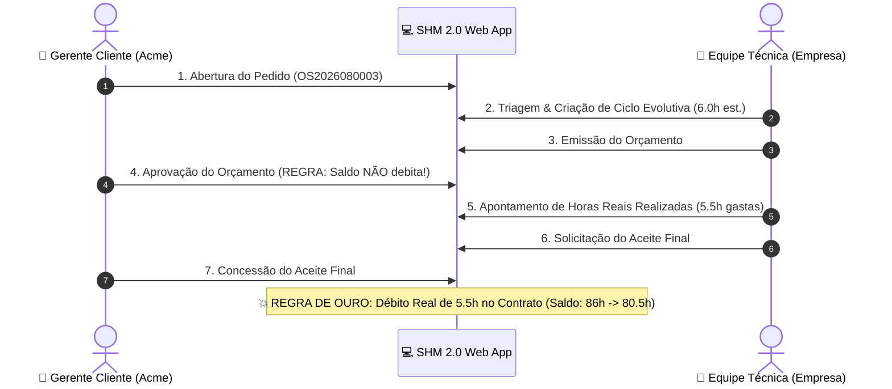

# 🧪 Guia Prático & Roteiro de Testes — SHM 2.0
> **Support Hours Manager (SHM 2.0)** — Governança e Gestão de Contratos de Suporte e Horas Técnicas.

Este documento consolida o roteiro passo a passo para testes funcionais e validação de regras de negócio da plataforma SHM 2.0, abrangendo desde os fluxos primordiais do ciclo de vida das demandas até auditoria de saldo e magic links.

---

## 🔑 1. Tabela de Acessos & Credenciais de Demonstração

| Perfil | Usuário | Senha | Papel no Sistema |
| :--- | :--- | :--- | :--- |
| 👔 **Cliente — Gerente** | `gerente.acme` | `cliente123` | Abre chamados, **aprova orçamentos**, **concede aceite final** e audita o extrato. |
| 🧑‍💻 **Cliente — Analista** | `analista.acme` | `cliente123` | Abre solicitações e acompanha o status no Kanban. |
| 🏢 **Empresa — Admin** | `admin` | `admin123` | Gestão de contratos, triagem operacional, criação de ciclos e orçamentação. |
| 🛠️ **Empresa — Técnico** | `tecnico` | `tecnico123` | Execução técnica, lançamento de tarefas/horas e solicitação de aceite. |

### 🌐 Endereços dos Serviços Locais
- 💻 **Aplicação Web (Frontend):** [http://localhost:5173](http://localhost:5173)
- 📑 **Documentação Swagger (OpenAPI):** [http://localhost:8000/api/docs/](http://localhost:8000/api/docs/)
- ⚙️ **Painel Administrativo Django:** [http://localhost:8000/admin/](http://localhost:8000/admin/)

> [!TIP]
> **Dica para Testes Concorrentes:** Abra uma **aba normal** no navegador para o perfil **Cliente** (`gerente.acme`) e uma **aba anônima** para a **Empresa** (`admin` ou `tecnico`). Assim você visualiza as ações refletindo em tempo real em ambas as pontas.

---

## ⚡ 2. FASE 1: Testes Primordiais (Regras de Ouro)

---

### 🧪 Teste Primordial 1: Abertura de Novo Pedido de Suporte
- [ ] **1.1.** Acesse `http://localhost:5173/login`.
- [ ] **1.2.** Clique no atalho rápido **"Gerente Cliente"** (ou use `gerente.acme` / `cliente123`).
- [ ] **1.3.** No topo direito do painel, clique em **"+ Novo Pedido"**.
- [ ] **1.4.** Preencha o formulário:
  - **Contrato:** Selecione `CT-2026-0001 (Acme Corp)`.
  - **Assunto:** `Desenvolvimento de Dashboard Financeiro`
  - **Descrição:** `Precisamos de um painel gerencial com gráficos de faturamento mensal e centros de custo.`
  - **Prioridade:** Selecione **"Alta"** (laranja).
- [ ] **1.5.** Clique em **"Abrir Pedido"**.
- [ ] **Validação Esperada:** O sistema gera o protocolo `OS2026080003`, abre a tela de detalhes com status **Aberto** e o card aparece na 1ª coluna do Kanban (*Abertos*).

---

### 🧪 Teste Primordial 2: Triagem Técnica & Emissão de Orçamento
- [ ] **2.1.** Em uma aba anônima, faça login como **Admin Empresa** (`admin` / `admin123`).
- [ ] **2.2.** Acesse o **Painel Operacional** em `http://localhost:5173/admin/dashboard`.
- [ ] **2.3.** Localize o chamado `OS2026080003` e clique no botão **"Triagem & Ciclos"**.
- [ ] **2.4.** Clique no botão **"+ Adicionar Ciclo"**:
  - **Tipo de Ciclo:** `Evolutiva`
  - **Horas Estimadas:** `6.0`
  - **Contexto Técnico:** `Modelagem do banco de dados e componentes visuais de gráfico.`
- [ ] **2.5.** Clique em **"Salvar Ciclo"** (o ciclo é registrado como *Orçado*).
- [ ] **2.6.** Clique no botão amarelo **"Emitir Orçamento"**.
- [ ] **Validação Esperada:** O ciclo passa para status *Aguardando Aprovação*. No Kanban do Cliente, o chamado avança automaticamente para a 3ª coluna (*Ag. Aprovação*).

---

### 🧪 Teste Primordial 3: REGRA DE OURO — Aprovação Sem Débito vs Aceite com Débito Real
- [ ] **3.1. Aprovação do Orçamento (Sem Débito):**
  - Na aba do **Gerente Cliente** (`gerente.acme`), abra o pedido `OS2026080003`.
  - Clique no botão **"Aprovar Orçamento (6.0h)"**.
  - 🔍 **Validação Crítica:** Verifique a barra lateral esquerda: **o saldo CONTINUA exatamente em 86.0h** (nenhuma hora é debitada na aprovação).
- [ ] **3.2. Execução Técnica & Apontamento Real:**
  - Na aba da empresa (`admin` ou `tecnico`), acesse a execução do ciclo aprovado.
  - Lance as tarefas realizadas:
    - Tarefa 1: `Estruturação das rotas de API` $\rightarrow$ `2.5h`
    - Tarefa 2: `Construção dos gráficos Tailwind` $\rightarrow$ `3.0h`
  - Total real realizado registrado: **`5.5h`** (inferior às 6.0h estimadas).
  - Clique em **"Finalizar & Solicitar Aceite do Cliente"**.
- [ ] **3.3. Aceite Final & Débito Real:**
  - Na aba do **Gerente Cliente**, recarregue o pedido.
  - Observe o botão verde: **"Conceder Aceite Final (5.5h)"**.
  - Clique em **"Conceder Aceite Final"**.
  - 🔍 **Validação Crítica:**
    - O ciclo é finalizado como *Aceito*.
    - O pedido é movido para a 6ª coluna do Kanban (*Concluídos*).
    - **O saldo do contrato na sidebar é debitado instantaneamente:** de `86.0h` para **`80.5h`** (débito exato das 5.5h reais!).

---

## 🔍 3. FASE 2: Testes Detalhados & Cenários Avançados

---

### 🧪 Teste 4: Auditoria do Ledger Imutável no Extrato do Contrato
- [ ] **4.1.** Logado como `gerente.acme`, clique no link **"Extrato Detalhado"** no card do contrato na barra lateral (ou acesse `/contratos/1/extrato`).
- [ ] **4.2.** Verifique os indicadores no topo:
  - **Horas Contratadas:** `100.0h`
  - **Consumo Acumulado:** `19.5h`
  - **Saldo Disponível:** `80.5h`
- [ ] **4.3.** Verifique a tabela de lançamentos:
  - O débito do ciclo do pedido `OS2026080003` consta com `-5.5h`, data, tipo e protocolo auditáveis.

---

### 🧪 Teste 5: Magic Link Público (Aprovação sem Login / Mobile)
- [ ] **5.1.** Como `admin`, crie um novo ciclo em qualquer pedido e clique em **"Emitir Orçamento"**.
- [ ] **5.2.** Acesse `http://localhost:8000/api/v1/ciclos/` e copie o `token_acesso` (UUID gerado para o ciclo).
- [ ] **5.3.** Em uma janela anônima (sem nenhum login ativo), acesse a URL:
  `http://localhost:5173/publico/ciclo/<TOKEN_UUID>`
- [ ] **Validação Esperada:** Renderiza a tela de aprovação executiva com resumo do escopo e botões diretos de 1 clique para aprovar ou aceitar sem necessidade de login.

---

### 🧪 Teste 6: Rejeição com Justificativa Obrigatória
- [ ] **6.1.** Em um ciclo com orçamento emitido, logado como Cliente, clique em **"Rejeitar Orçamento"**.
- [ ] **6.2.** Na janela modal, informe a justificativa: *"Necessário rever a estimativa para atender apenas ao módulo básico."*
- [ ] **6.3.** Clique em **"Confirmar Recusa"**.
- [ ] **Validação Esperada:** O ciclo retorna para a equipe técnica com status *Rejeitado* e a justificativa visível para readequação de escopo.

---

### 🧪 Teste 7: Feed de Mensagens e Comunicação Técnica do Ciclo
- [ ] **7.1.** Na tela de detalhes de qualquer chamado, role até a seção **Comentários & Histórico do Ciclo**.
- [ ] **7.2.** Envie uma mensagem como Cliente e outra como Técnico.
- [ ] **Validação Esperada:** Mensagens são listadas cronologicamente com o nome do autor, crachá do perfil (`Gerente Cliente` vs `Admin Empresa`) e horário exato.

---

## 📊 Matriz de Cobertura dos Testes

| ID | Cenário de Teste | Perfil Responsável | Resultado Esperado | Status |
| :---: | :--- | :---: | :--- | :---: |
| **TP-01** | Abertura de Demanda | Cliente | Geração de protocolo sequencial e Kanban atualizado | 🟢 Pronto |
| **TP-02** | Decomposição em Ciclos & Orçamento | Empresa | Ciclo criado e avanço para Ag. Aprovação | 🟢 Pronto |
| **TP-03** | Aprovação de Orçamento | Cliente | Status avança SEM debitar saldo de horas | 🟢 Pronto |
| **TP-04** | Apontamento de Horas Reais | Empresa | Registro de tarefas e cálculo do total gasto | 🟢 Pronto |
| **TP-05** | Aceite Final & Débito | Cliente | Ciclo concluído e débito exato no saldo | 🟢 Pronto |
| **TD-01** | Extrato e Ledger Imutável | Cliente / Empresa | Histórico de débitos auditável e transparente | 🟢 Pronto |
| **TD-02** | Magic Link Público | Usuário Externo | Aprovação segura via token sem autenticação | 🟢 Pronto |
| **TD-03** | Recusa com Justificativa | Cliente | Rejeição registrada com motivo obrigatório | 🟢 Pronto |
| **TD-04** | Feed de Comunicação | Todos | Mensagens em tempo real vinculadas ao ciclo | 🟢 Pronto |