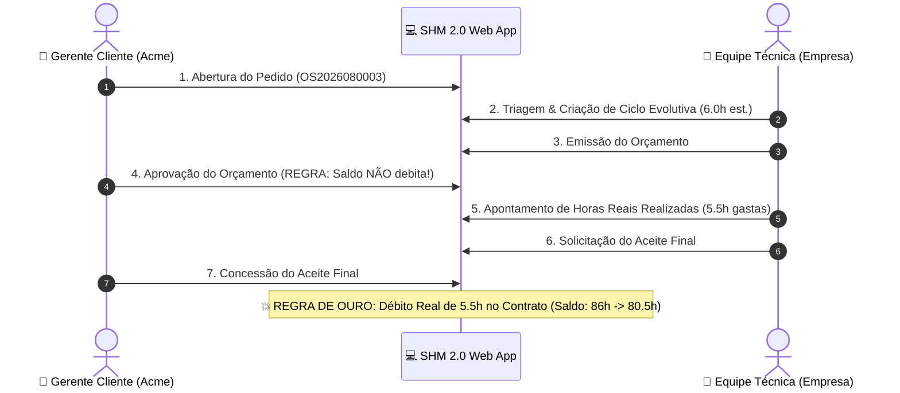

# 🧪 Guia Prático & Roteiro de Testes — SHM 2.0

> **Support Hours Manager (SHM 2.0)** — Governança e Gestão de Contratos de Suporte e Horas Técnicas.

Este documento consolida o roteiro passo a passo para testes funcionais e validação de regras de negócio da plataforma SHM 2.0. **Todos os dados de entrada foram estruturados em blocos de código com botão de cópia de 1 clique** para agilizar a execução dos testes.

---

## 🔑 1. Tabela de Acessos & Credenciais de Demonstração

| Perfil | Usuário | Senha | Papel no Sistema |
| :--- | :--- | :--- | :--- |
| 👔 **Cliente — Gerente** | `gerente.acme` | `cliente123` | Abre chamados, **aprova orçamentos**, **concede aceite final** e audita o extrato. |
| 🧑‍💻 **Cliente — Analista** | `analista.acme` | `cliente123` | Abre solicitações e acompanha o status no Kanban. |
| 🏢 **Empresa — Admin** | `admin` | `admin123` | Gestão de contratos, triagem operacional, criação de ciclos e orçamentação. |
| 🛠️ **Empresa — Técnico** | `tecnico` | `tecnico123` | Execução técnica, lançamento de tarefas/horas e solicitação de aceite. |

### 🌐 Endereços dos Serviços Locais

- 💻 **Aplicação Web (Frontend):**
```text
http://localhost:5173
```

- 📑 **Documentação Swagger (OpenAPI):**
```text
http://localhost:8000/api/docs/
```

- ⚙️ **Painel Administrativo Django:**
```text
http://localhost:8000/admin/
```

> [!TIP]
> **Dica para Testes Concorrentes:** Abra uma **aba normal** no navegador para o perfil **Cliente** (`gerente.acme`) e uma **aba anônima** para a **Empresa** (`admin` ou `tecnico`). Assim você visualiza as ações refletindo em tempo real em ambas as pontas.

---

## ⚡ 2. FASE 1: Testes Primordiais (Regras de Ouro)



---

### 🧪 Teste Primordial 1: Abertura de Novo Pedido de Suporte

- [ ] **1.1.** Acesse a tela de login:
```text
http://localhost:5173/login
```

- [ ] **1.2.** Clique no atalho rápido **"Gerente Cliente"** ou utilize as credenciais:
  - **Usuário:**
  ```text
  gerente.acme
  ```
  - **Senha:**
  ```text
  cliente123
  ```

- [ ] **1.3.** No topo direito do painel, clique no botão **"+ Novo Pedido"** (ou acerte a URL `http://localhost:5173/pedidos/novo`).

- [ ] **1.4.** Preencha os campos do formulário:
  - **Contrato:** Selecione `CT-2026-0001 (Acme Corp)`
  - **Assunto / Título:**
  ```text
  Desenvolvimento de Dashboard Financeiro
  ```
  - **Descrição Detalhada:**
  ```text
  Precisamos de um painel gerencial com gráficos de faturamento mensal e centros de custo.
  ```
  - **Prioridade:** Selecione **"Alta"** (botão laranja).

- [ ] **1.5.** Clique em **"Abrir Pedido"**.
- [ ] **Validação Esperada:**
  - O sistema gera o protocolo sequencial `OS2026080003`.
  - Redireciona automaticamente para a tela de detalhes do chamado com status **Aberto**.
  - O chamado aparece na 1ª coluna (*Abertos*) do Kanban no Dashboard.

---

### 🧪 Teste Primordial 2: Triagem Técnica & Emissão de Orçamento

- [ ] **2.1.** Em uma janela/aba anônima, faça login como **Admin Empresa**:
  - **Usuário:**
  ```text
  admin
  ```
  - **Senha:**
  ```text
  admin123
  ```

- [ ] **2.2.** Acesse o **Painel Operacional**:
```text
http://localhost:5173/admin/dashboard
```

- [ ] **2.3.** Localize o chamado recém-aberto (`OS2026080003`) e clique em **"Triagem & Ciclos"**.

- [ ] **2.4.** Clique no botão **"+ Adicionar Ciclo"** e preencha:
  - **Tipo de Ciclo:** Selecione `Evolutiva`
  - **Horas Estimadas (Orçamento):**
  ```text
  6.0
  ```
  - **Contexto Técnico do Escopo:**
  ```text
  Modelagem do banco de dados e componentes visuais de gráfico.
  ```

- [ ] **2.5.** Clique em **"Salvar Ciclo"** (o ciclo é registrado com status *Orçado*).
- [ ] **2.6.** No card do ciclo, clique no botão amarelo **"Emitir Orçamento"**.
- [ ] **Validação Esperada:**
  - O ciclo passa para o status **Aguardando Aprovação**.
  - No painel/Kanban do Cliente, o chamado avança automaticamente para a 3ª coluna (*Ag. Aprovação*).

---

### 🧪 Teste Primordial 3: REGRA DE OURO — Aprovação Sem Débito vs Aceite com Débito Real

- [ ] **3.1. Aprovação do Orçamento (Sem Débito):**
  - Na aba do **Gerente Cliente** (`gerente.acme`), abra o chamado `OS2026080003`.
  - Clique no botão roxo **"Aprovar Orçamento (6.0h)"**.
  - 🔍 **Validação Crítica:** Verifique a barra lateral esquerda de contratos: **o saldo CONTINUA exatamente em 86.0h** (nenhuma hora é debitada na aprovação do orçamento).

- [ ] **3.2. Execução Técnica & Apontamento Real:**
  - Na aba da empresa (`admin` ou `tecnico`), acesse a tela de execução do ciclo aprovado (botão **"Ir para Execução"** ou `/admin/ciclos/<ID>/execucao`).
  - Lance os 2 apontamentos de tarefas realizadas:
    - **Tarefa 1:**
      - Descrição:
      ```text
      Estruturação das rotas de API
      ```
      - Horas:
      ```text
      2.5
      ```
    - **Tarefa 2:**
      - Descrição:
      ```text
      Construção dos gráficos Tailwind
      ```
      - Horas:
      ```text
      3.0
      ```
  - Observe o total gasto registrado: **5.5h** (menor que as 6.0h orçadas).
  - Clique no botão verde: **"Finalizar & Solicitar Aceite do Cliente (5.5h)"**.

- [ ] **3.3. Aceite Final & Débito Real:**
  - Na aba do **Gerente Cliente**, recarregue o chamado `OS2026080003`.
  - Observe o botão verde: **"Conceder Aceite Final (5.5h)"**.
  - Clique em **"Conceder Aceite Final"**.
  - 🔍 **Validação Crítica:**
    - O ciclo é finalizado como **Aceito**.
    - O chamado vai para a 6ª coluna do Kanban (*Concluídos*).
    - **O saldo do contrato na barra lateral é debitado instantaneamente:** de `86.0h` para **`80.5h`** (débito exato das 5.5h reais executadas!).

---

## 🔍 3. FASE 2: Testes Detalhados & Cenários Avançados

---

### 🧪 Teste 4: Auditoria do Ledger Imutável no Extrato do Contrato

- [ ] **4.1.** Logado como `gerente.acme`, acesse o extrato do contrato:
```text
http://localhost:5173/contratos/1/extrato
```

- [ ] **4.2.** Verifique os indicadores no topo:
  - **Horas Contratadas:** `100.0h`
  - **Consumo Acumulado:** `19.5h` (14.0h anteriores + 5.5h da OS2026080003)
  - **Saldo Disponível:** `80.5h`

- [ ] **4.3.** Verifique a tabela de histórico de lançamentos:
  - O débito do ciclo da OS `OS2026080003` consta com `-5.5h`, tipo `Evolutiva`, data/hora e contexto auditáveis.

---

### 🧪 Teste 5: Magic Link Público (Aprovação sem Login / Mobile)

- [ ] **5.1.** Como `admin`, em qualquer pedido, adicione um novo ciclo e clique em **"Emitir Orçamento"**.
- [ ] **5.2.** Obtenha o token UUID do ciclo na API:
```text
http://localhost:8000/api/v1/ciclos/
```
*(Copie o valor do campo `token_acesso` correspondente)*

- [ ] **5.3.** Em uma janela anônima (sem login ativo), abra a URL do Magic Link:
```text
http://localhost:5173/publico/ciclo/<TOKEN_UUID>
```

- [ ] **Validação Esperada:**
  - Renderiza o card executivo de aprovação com protocolo, cliente, escopo e horas.
  - Permite **Aprovar** ou **Rejeitar** o orçamento diretamente em 1 clique sem login.

---

### 🧪 Teste 6: Rejeição com Justificativa Obrigatória

- [ ] **6.1.** Em um ciclo com status *Aguardando Aprovação*, logado como Cliente, clique em **"Rejeitar Orçamento"**.
- [ ] **6.2.** No modal, cole a justificativa técnica:
```text
Necessário rever a estimativa para atender apenas ao módulo básico de exportação.
```
- [ ] **6.3.** Clique em **"Confirmar Recusa"**.
- [ ] **Validação Esperada:** O ciclo retorna para a equipe técnica com status **Orçado** para readequação de escopo.

---

### 🧪 Teste 7: Feed de Mensagens e Comunicação Técnica do Ciclo

- [ ] **7.1.** Na tela de detalhes de qualquer chamado, role até a seção **Comentários & Histórico do Ciclo**.
- [ ] **7.2.** Envie uma mensagem como Cliente (`gerente.acme`):
```text
Favor verificar os detalhes do layout e prazos de entrega.
```
- [ ] **7.3.** Em seguida, responda como Técnico (`tecnico`):
```text
Entendido! Já estamos implementando conforme solicitado.
```
- [ ] **Validação Esperada:** Mensagens são exibidas cronologicamente com identificação de autor, crachá do perfil (`Gerente Cliente` vs `Empresa — Técnico`) e horário exato.

---

## 📊 Matriz de Cobertura dos Testes

| ID | Cenário de Teste | Perfil Responsável | Resultado Esperado | Status |
| :---: | :--- | :---: | :--- | :---: |
| **TP-01** | Abertura de Demanda | Cliente | Geração de protocolo sequencial e Kanban atualizado | 🟢 Pronto |
| **TP-02** | Decomposição em Ciclos & Orçamento | Empresa | Ciclo criado e avanço para Ag. Aprovação | 🟢 Pronto |
| **TP-03** | Aprovação de Orçamento | Cliente | Status avança SEM debitar saldo de horas | 🟢 Pronto |
| **TP-04** | Apontamento de Horas Reais | Empresa | Registro de tarefas e cálculo do total gasto | 🟢 Pronto |
| **TP-05** | Aceite Final & Débito | Cliente | Ciclo concluído e débito exato no saldo | 🟢 Pronto |
| **TD-01** | Extrato e Ledger Imutável | Cliente / Empresa | Histórico de débitos auditável e transparente | 🟢 Pronto |
| **TD-02** | Magic Link Público | Usuário Externo | Aprovação segura via token sem autenticação | 🟢 Pronto |
| **TD-03** | Recusa com Justificativa | Cliente | Rejeição registrada com motivo obrigatório | 🟢 Pronto |
| **TD-04** | Feed de Comunicação | Todos | Mensagens em tempo real vinculadas ao ciclo | 🟢 Pronto |
